## Binary + hex display module
What started out as a way to work on a prototype turned into a pretty cool display for a modular trainer.

## Motivation
I wanted an easy way to glance at the bus signals on my breadboard Z80 prototype. The goal of my Z80 computer is to learn about about what a cpu does, and watch it interact with memory and peripherals.

This means having features such as:

- writing to memory by hand
- stopping the clock
- single stepping the processor
- observe the state of the buses and I/O

This can be done either mostly in software, or mostly in hardware. When it's software we call it a monitor program, and for hardware it's commonly called a trainer. In my case, I want to add these features in hardware.

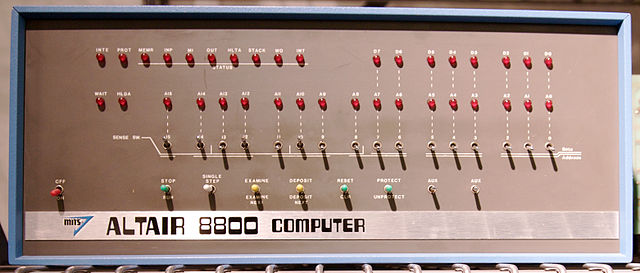

Flipping switches to bootstrap your paper tape driver [is very humbling](https://www.youtube.com/watch?v=5zbtNImG2NE).

My trainer will be based on the Z80, having an 8-bit databus and a 16-bit memory address space. The first step was to get the cpu up and running and verify that the program counter was working. This can basically be done with resistors and power and a single LED. I got a lot of inspiration from [this video](https://www.youtube.com/watch?v=AZb4NLXx1aMchip).

## Input first
First, I prototyped the "Keyboard" module.

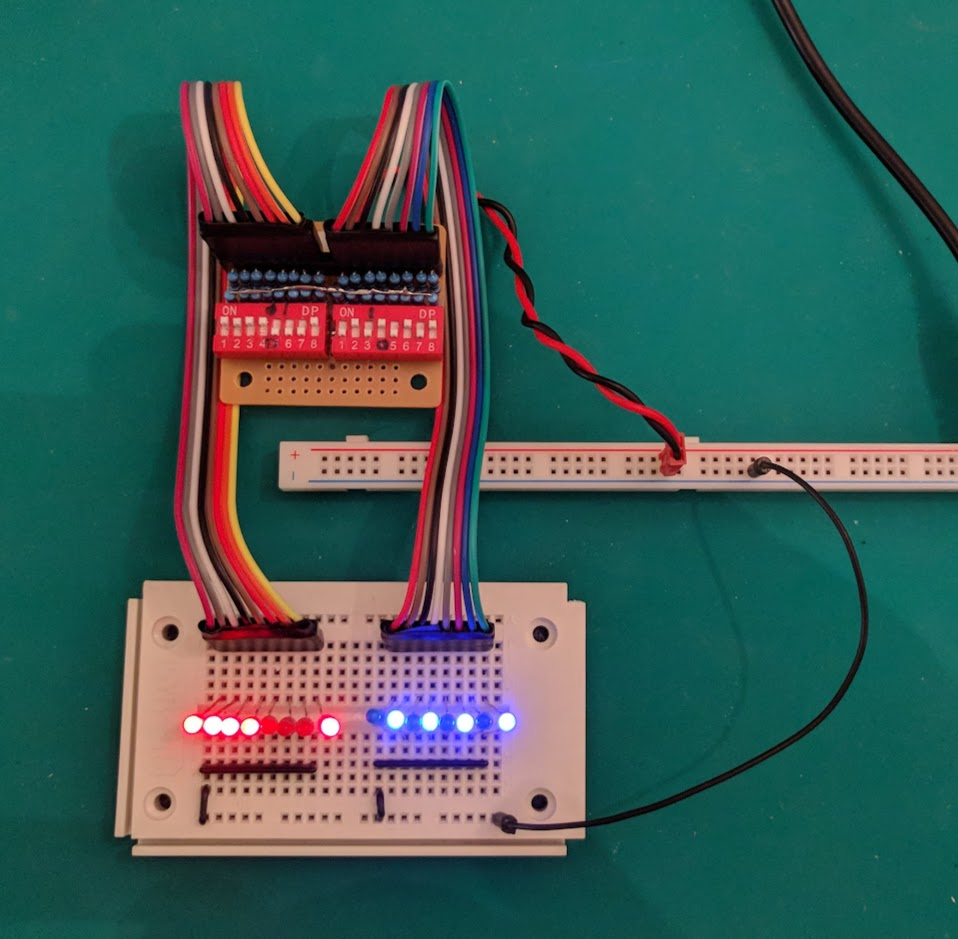

## Simple prototype
Next, I wanted a simple way to test the keyboard module separate from the Z80. First I prototyped on a breadboard as shown above. The next step was to compact it into a module.

I wanted to make something compact that could be put into a breadboard to peek at the signals on a certain bus. I fell in love with the way the LEDs, resistor network, and header went together. This is functionally equivalent to the breadboard version shown in the "keyboard" photo.

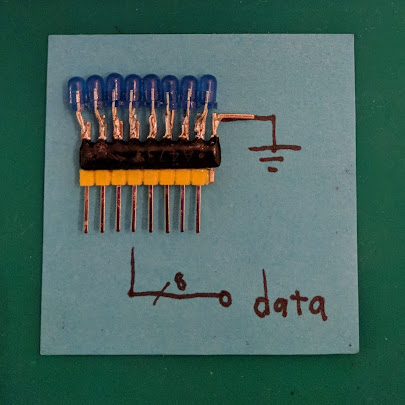{: width=70% }

But alas, this design had a problem.

I was getting some weird results when testing on the real Z80. I thought I just needed to tweak the resistance to something less power-hungry. If you draw too much current, you might influence the levels you are trying to display. This would interfere with the operation of the Z80. I asked the datasheet: "is it possible to have a low enough current that I don't need to buffer when I am on the data bus for instance?" My CMOS Z80 can output one TTL load, so yes, but because it is active high but open collector you cannot source enough current in the "On" state. This is compounding by the fact the TTL levels are not actually 5 volts and therefore it might not actually have enough headroom to light some voltages of LED.

## Buffers
In order to overcome the issue of sourcing current, we can use a buffer. This repeats and optionally inverts a bus of signals. This solution probably seems obvious to someone who has worked with open collector buses before, but it took some research and deep reading of datasheets to understand what was going on here. It seemed overly complicated but is just the reality of open collector style buses. There are modern replacements for this such as tristate which pull in both directions but also have a high-impedance or 'Z' state. The Art of Electronics has a really good chapter on interfacing with peripherals and it covers this quite well.

This is the first prototype after realizing I really would need the buffer.

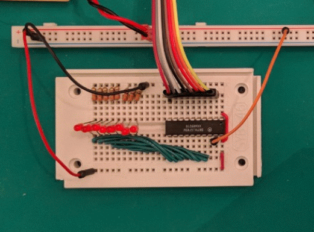

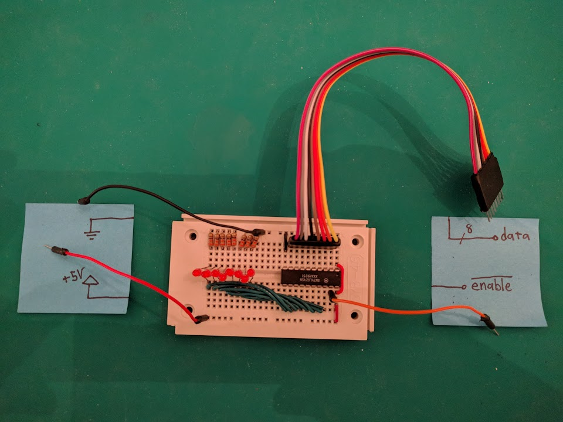

## Hex
Then I found some really cool hex displays on ebay. These have all of the decoding circuitry within them and so are easy to interface. I kinda became obsessed with this simplicity and so I found some rotary switched which have the hex encoding built into the mechanics of the switch.

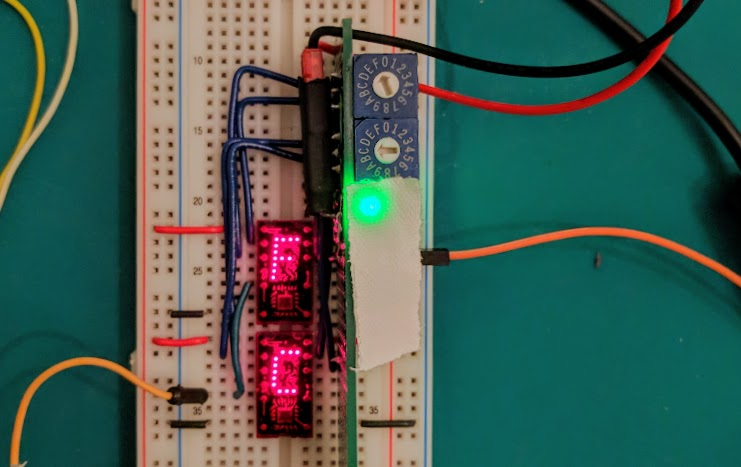

These switches are used in "Keyboard 2.0".

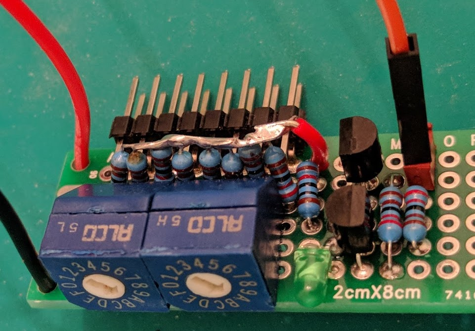

## Finalizing the hex display
I came upon a kit for making 16bit ribbon cables that fit right onto header pins. I incorporated this into a tight layout but I wanted a clean way to do the point to point soldering.

After some research I found a good description of a method here: <http://elm-chan.org/docs/wire/wiring_e.html>. The suggestion to build a self tensioning pen is great and the quality of the result was impressive.

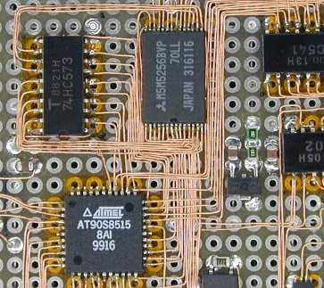

I was inspired to replicate this technique.

Here's my toolkit:

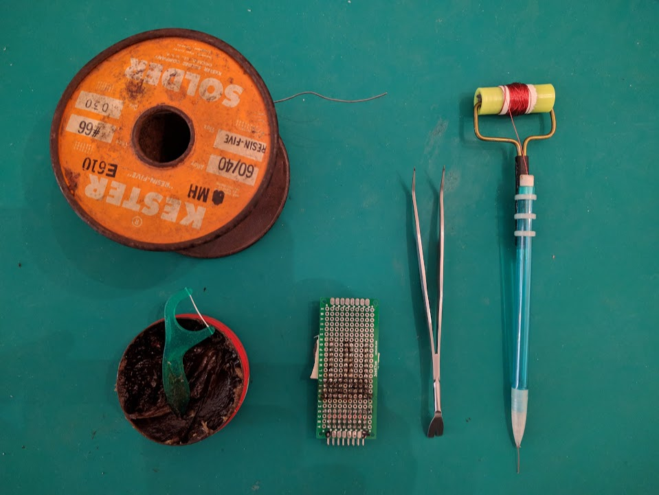

Tension kept by the viscous damping of a kneadable eraser.

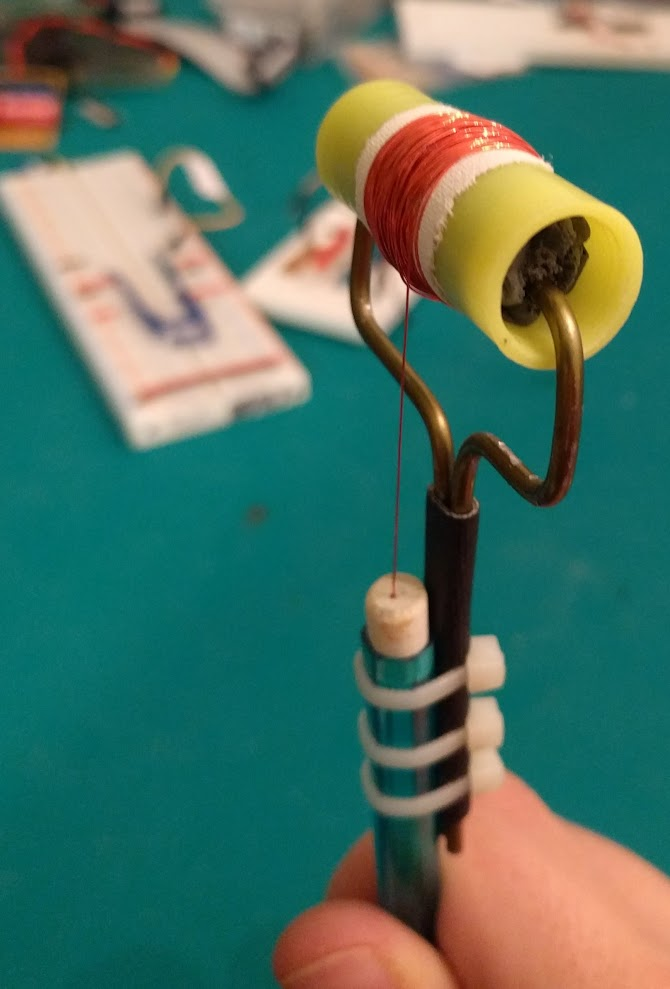

Amazing how nice it is to route using this simple device.

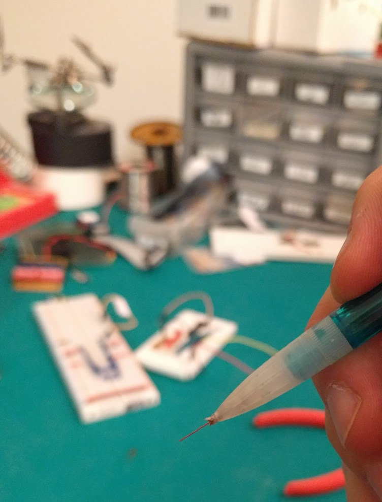

First layout

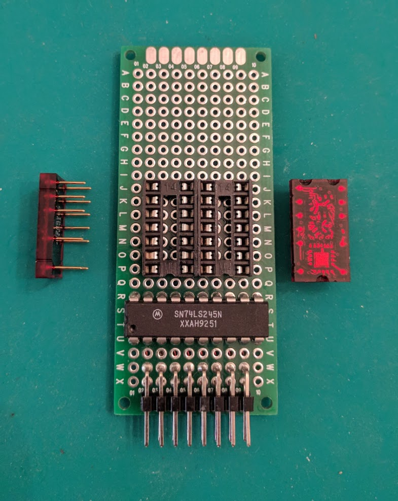

Hold the pieces in place with gaffers tape

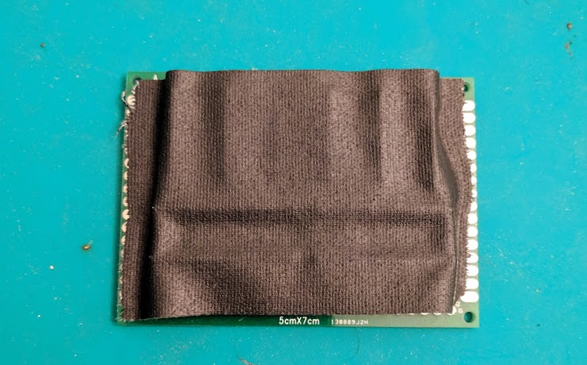

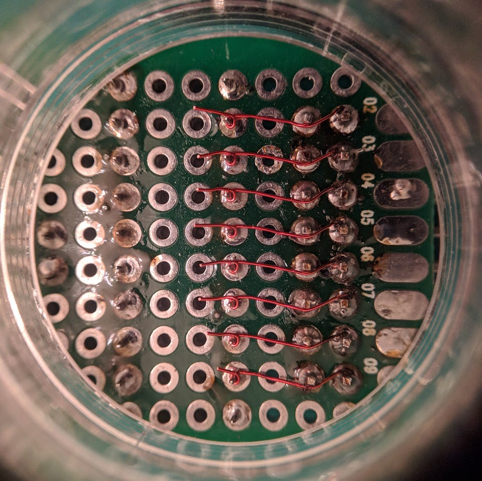

It's alright to have crossing wires because we only remove enamel at the solder joint.

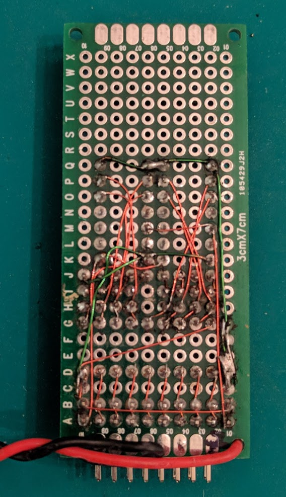

These two devices are equivalent, each having a 8 bits of hex and 8 bits of binary. The final module is satisfyingly compact.

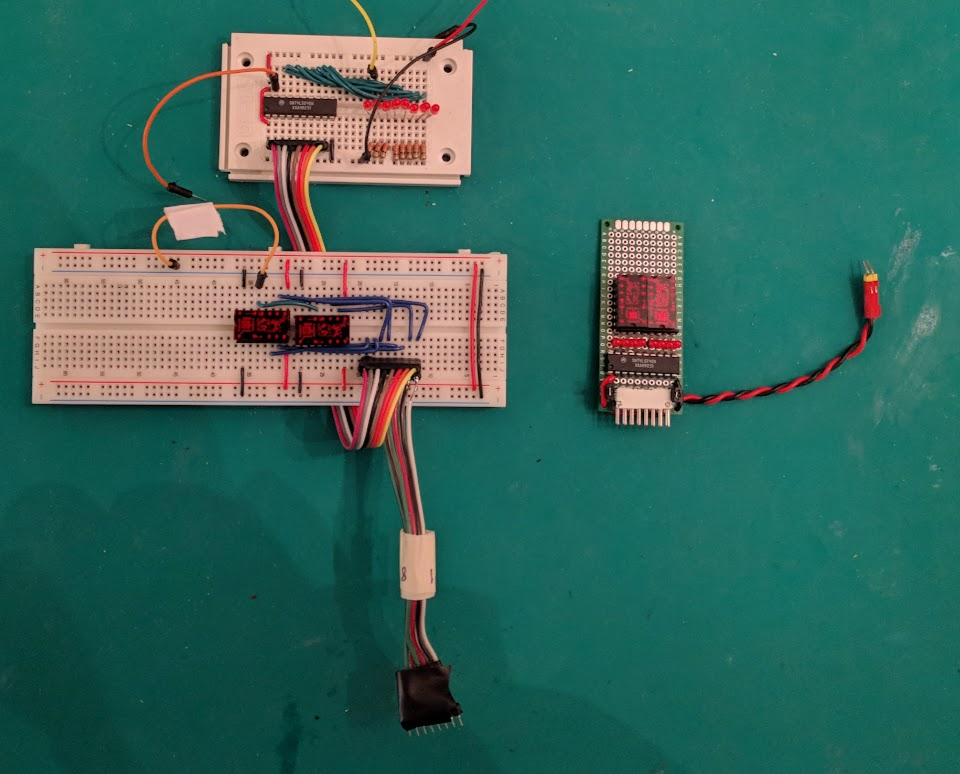

Driving the finished module with an arduino to test.

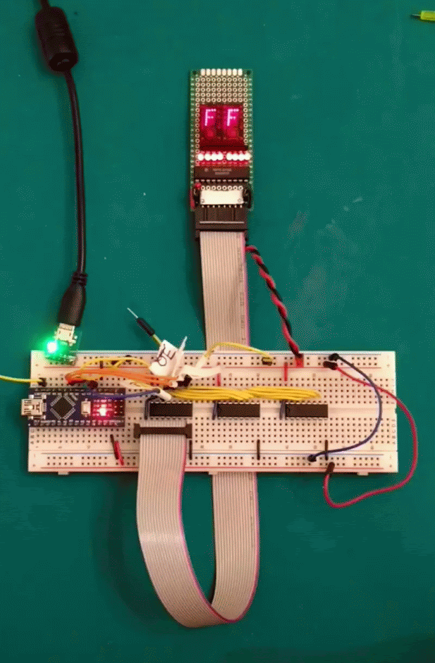
