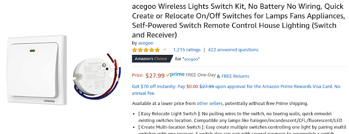
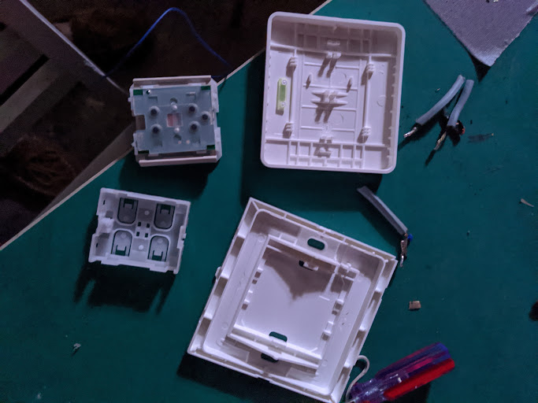
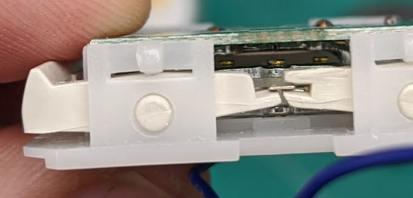
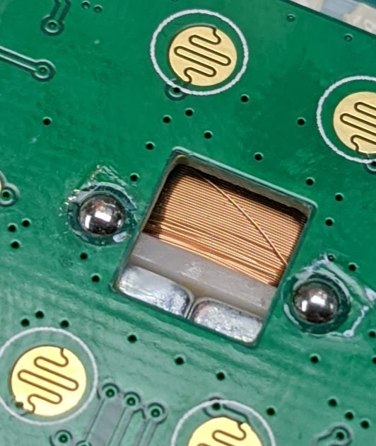

## Robust wireless light switch
I was looking for a system of wireless switches that didn't rely on wifi. I wanted something standalone because of reliability and security. I noticed one brand advertised "no battery" and I took that at face value.

## Too good to be true
Sometime after installing I was talking to a co-worker and we started wondering: "Could it be a sealed lithium battery?" I knew this was done in the 10 year no maintenance smoke detectors, and I thought the "battery free" might actually be marketing lies.

{: width=60% }

## Teardown
A large mechanical switch, with a smaller module in the center. There are more membrane switches than one would expect for an on off switch. The antenna was run around the outside.

There are levers which are moved by the switch and seem to move something back and forth internally.

Aha, magnets and a coil, it really does generate its own power!

