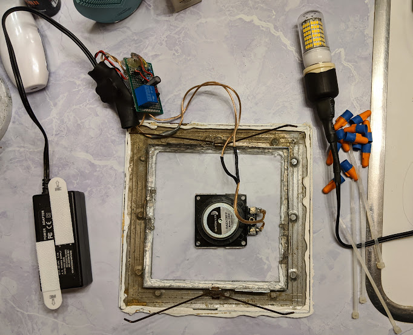
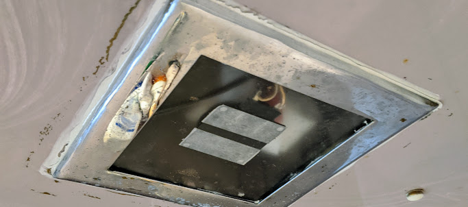
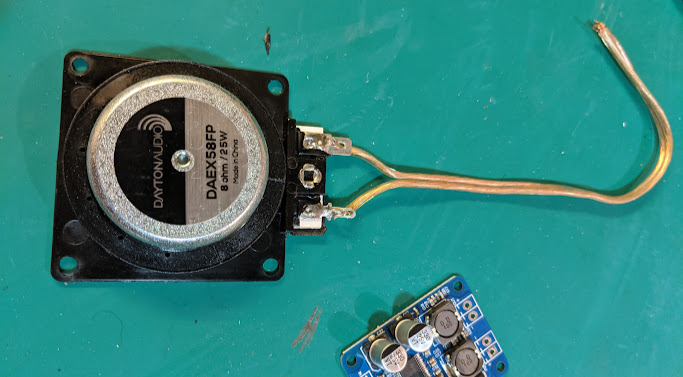
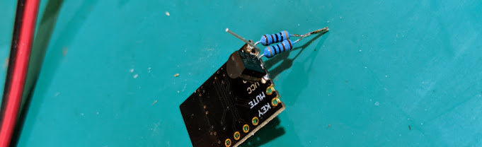
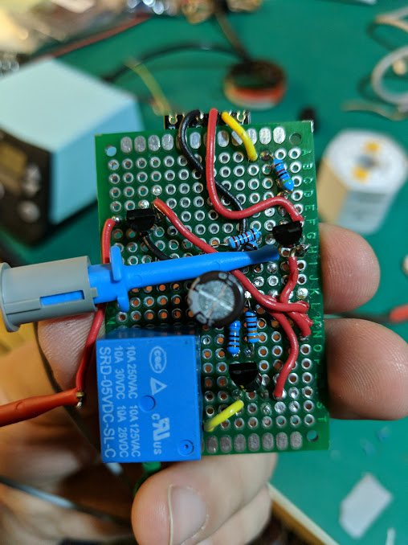
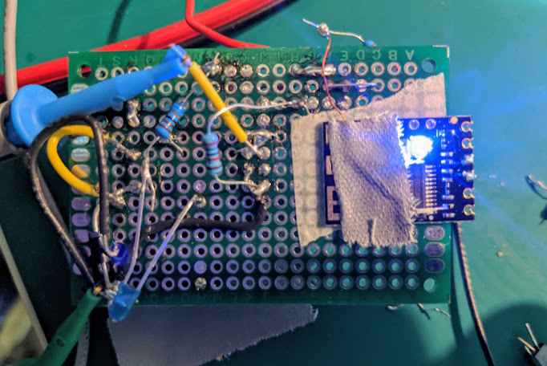
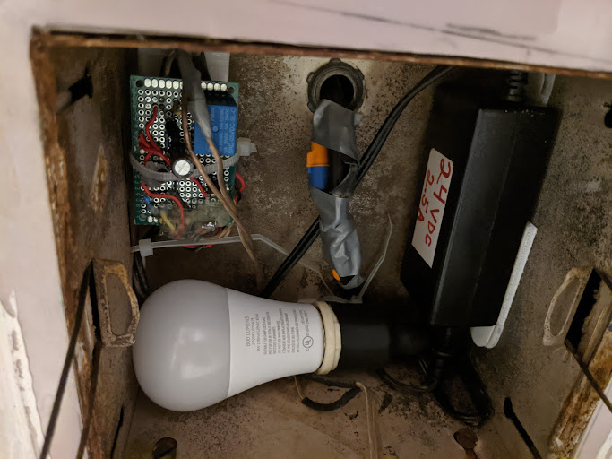
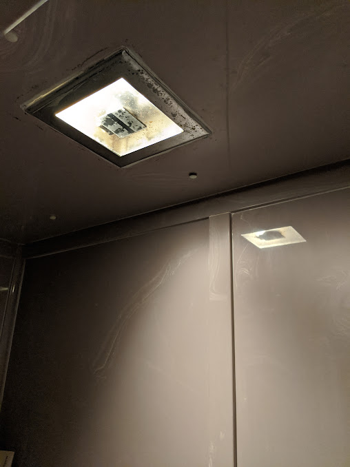

## Chasing the dream, shower + music
I have numerous methods for listening to music and talks in the shower. The first one was a waterproof, battery powered AM/FM radio. The reception was crap. Over the years, other solutions included bluetooth speakers of various quality.

The problem is that it is quite hard to get a speaker loud enough from outside of the shower. Before I moved I had pretty good results with a google home mini and double-sided tape. The new house though has sliding glass doors and that wouldn't work.

For a while I had given up and just brought my phone in.

## Take it up a notch
In the new house, I started thinking about modding the light fixture for sound.

After some thinking, I thought I had my options:

- Google Home Mini inside the light.
- Round speaker to replace the light.
- Keep using phone.

But while I was looking for a suitable speaker I remembered something I had seen on youtube.

<https://www.youtube.com/watch?v=CKIye4RZ-5k>

It is basically a voice-coil that can be attached to a flat surface to turn it into an active acoustic radiator. That's fancy for "speaker".

I figured this would be great because it would maximize the surface area of the speaker, and it would also allow me to continue using the light fixture normally. It could also be reversibly installed.

## Parts list
Goal: Integrate using cheapest junk modules available from internet.

- Voice coil - [$16.89](https://www.amazon.com/gp/product/B00CWEJJ9K)
- Bluetooth Module - [$2.89/ea](https://www.amazon.com/gp/product/B07W4PJ469)
- Amplifier - [$5.99](https://www.amazon.com/gp/product/B01HXU1G02)
- Power Supply - Had on hand

## Interesting bits

### Mixing signals
Since almost all bluetooth receivers are stereo I had to mix the signals.

### Delay on for amplifier
I needed to design a delay circuit for the amplifier for two reasons.

#### Annoying connection chimes
The default recording for "connected, on, etc" are annoying in general. The fact we have this tied into the light means it would have made annoying noises throughout the day, and worse, at night.

{: width=50% }

#### Turn-on thump
Secondly, if the amp turned on before the bluetooth, very loud "turn-on" thumps came through. I am proud of the hack for this one: I used an RC circuit to couple the delay to the status LED. The duty cycle of the "Connecting" blink would delay the amplifier indefinitely; however the solid "Connected" glow would put the amplifier on just after the crappy "connected" alert sound played.

### Bad documentation
Documentation for the bluetooth module was wrong and the "multi-purpose" button needed to be tied to ground to prevent phantom triggering. In hindsight this was obvious, but it was trust myself and disregard their schematic. Intermittent connection failures plagued me during almost the entire project. It was just infrequent enough to allow me to work through all the other parts of the project, but not enough to pinpoint the problem quickly.

## Final state
I installed everything in a way that I could reverse everything easily in case we leave. The sound is incredibly loud, and the quality is decent. As the shower is all smooth surfaces, it can be a bit echoey. Maybe some foam/fiberglass would help, but I don't want this thing catching fire. Overall I'm extremely happy with how it turned out.

And of course it still works as a light.

