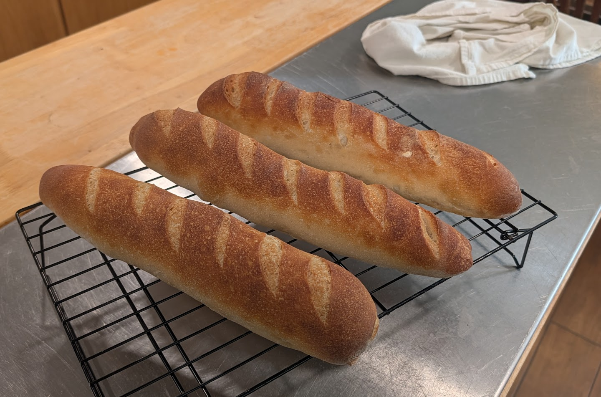
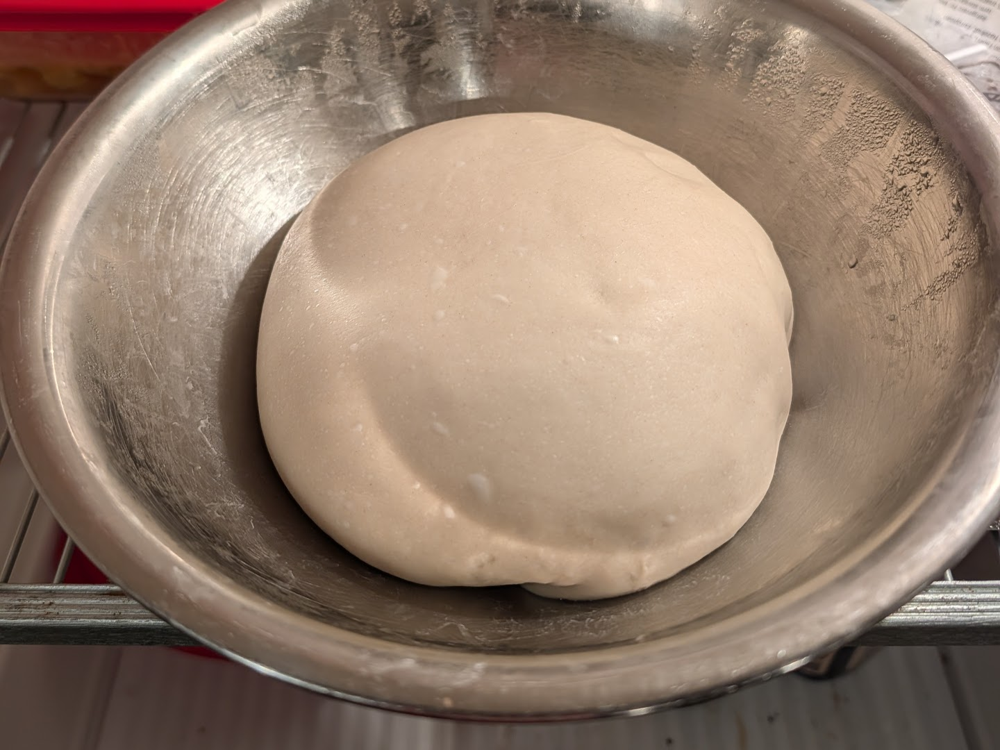
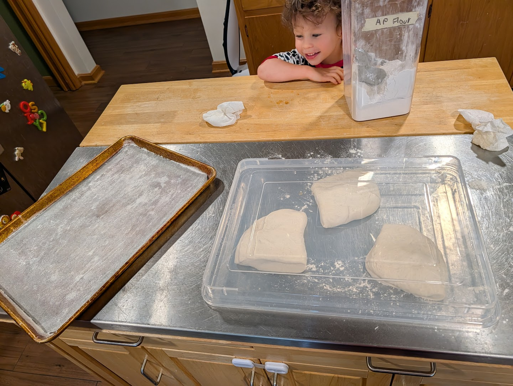
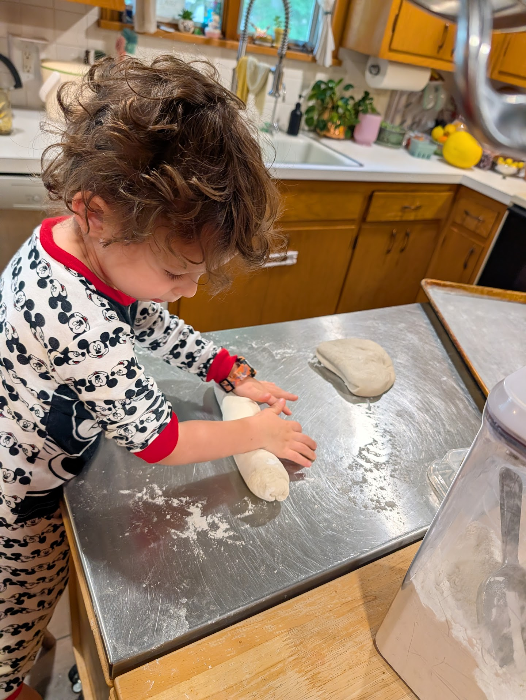
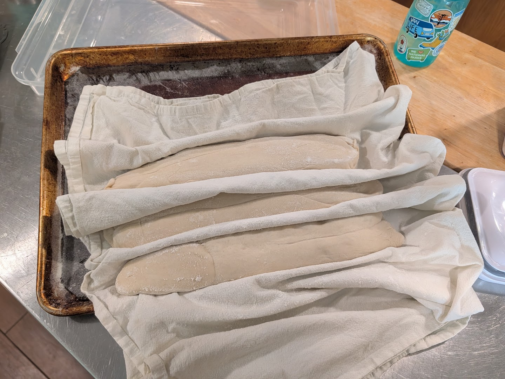
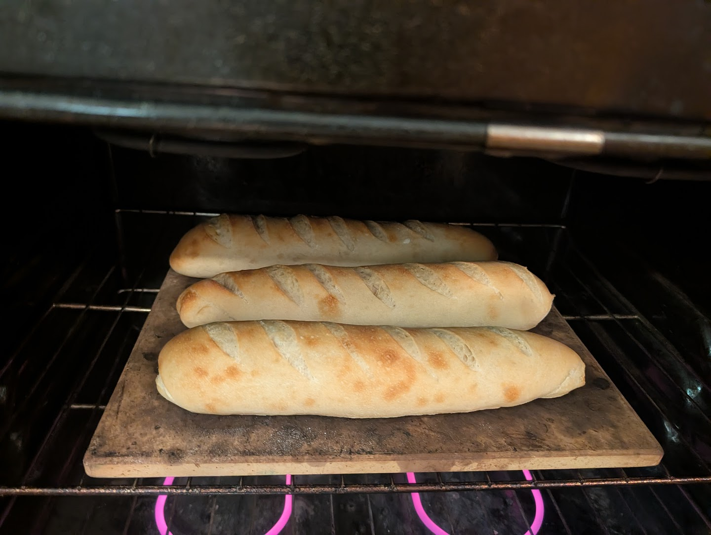

Makes **3 small baguettes**.

!!! ingredients "Ingredients"
    - 500 g AP flour[^ap-flour]
    - 325 g water
    - 10 g salt
    - 1 g instant yeast

[^ap-flour]: [King Arthur's Martin](https://www.kingarthurbaking.com/blog/2021/03/17/all-about-classic-baguettes) argues you should stick to AP flour for classic baguettes rather than bread flour.

## Mix
Start around noon to allow time for the room-temperature bulk and cold bulk fermentation steps.

Add to stand mixer bowl:

- 500 g flour
- 325 g water
- 10 g salt
- 1 g instant yeast

Mix with dough hook until smoother, elastic, and mostly clearing the sides, but still tacky. No full windowpane needed.

## Room-temp bulk

Transfer to a covered container.

Do **2 folds** during the first hour:

- **Fold 1:** after 30 min
- **Fold 2:** after 60 min

Each fold: wet hands, stretch one side up and over, rotate, repeat 4 times.

After bulk, dough should be smoother and slightly puffy, not doubled.

## Cold bulk

Cover tightly and refrigerate overnight.

## Next morning preheat

Preheat oven with stone/steel or inverted sheet pan:

- **475°F / 250°C**

Place empty metal steam pan on lower rack.

## Divide and preshape

Turn cold dough onto lightly floured counter.

Divide into **3 equal pieces**.

Preshape each into a short loose log.

- **Rest:** 20 min, covered

## Shape

For each piece:

1. Pat gently into a rectangle.
2. Fold top edge to center and seal.
3. Fold bottom edge over and seal.
4. Roll from center outward to baguette length.

Place seam-side up on a floured towel/couche.

## Final proof
- **Proof:** 30–45 min

Ready when slightly puffy and slow to spring back when poked. For traditional baguettes, slightly under-proof — this keeps the crumb denser.

I proofed seam-side up on a flour sack towel so I could flip each loaf directly onto the preheated stone. I want to try flipping onto a peel first instead, then using the peel to transfer onto the stone.

## Score and bake

Score shallow diagonal cuts.

After transferring onto the stone, quickly mist the loaves with water to gelatinize the crust.

Add steam:

- Pour 1 cup boiling water into hot steam pan.

Bake:

- **475°F / 250°C with steam:** 10 min
- **Remove steam pan / vent oven:** 10–12 min

Cool at least **20 min** before cutting.
