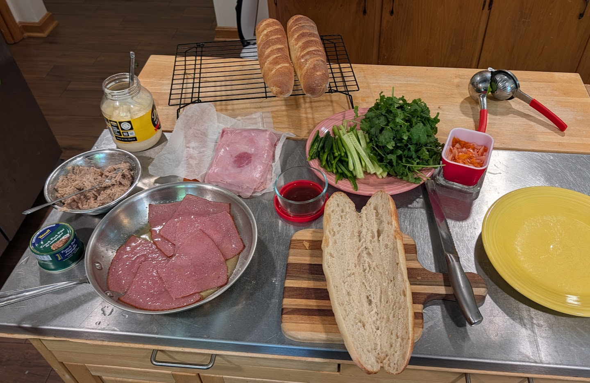
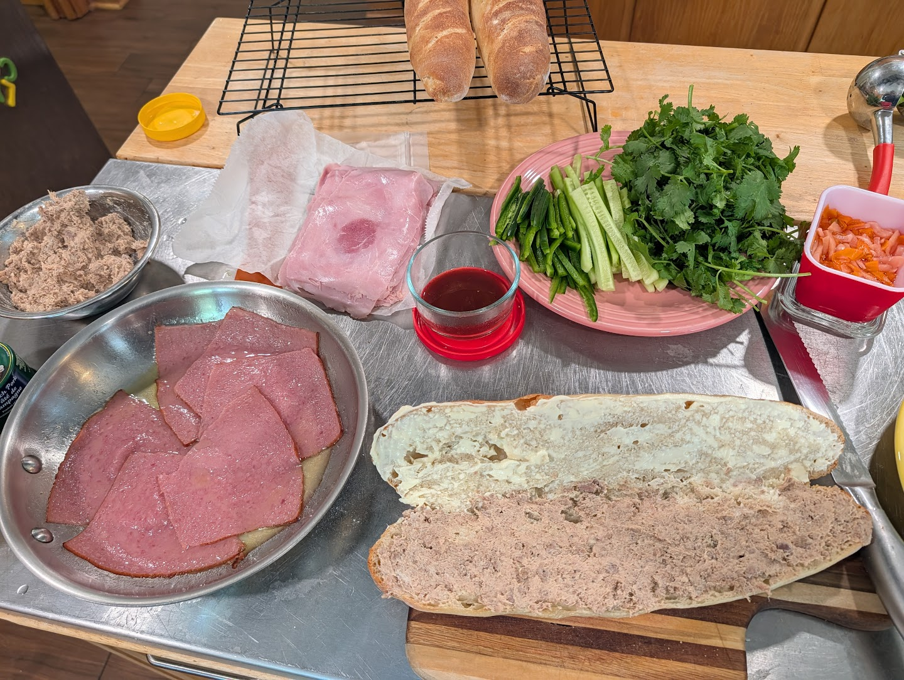
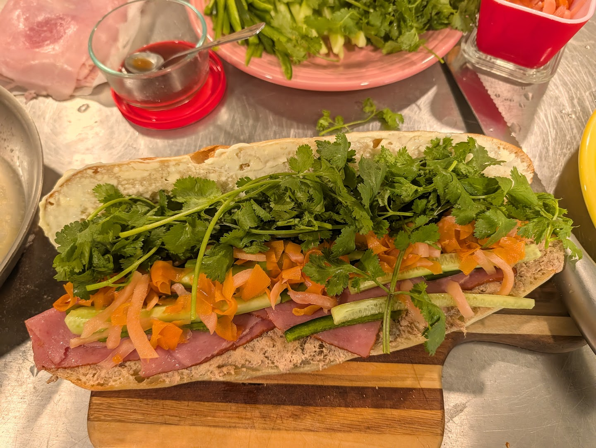

A bánh mì fork of the [baguette recipe]({filename}/food/baguette.md). The bread
is the whole game: **AP flour, same-day, small rolls, fully proofed, baked hot
and short** for a thin crisp crust over a light collapsible crumb. Then the
sandwich.

!!! note
    This bread is a revision of the [baguette]({filename}/food/baguette.md),
    retuned for bánh mì to be **less chewy** — AP flour instead of bread flour,
    smaller fully-proofed rolls, and a hotter, shorter bake for a thinner crust
    over a lighter, more collapsible crumb. I haven't baked this exact formula
    yet, so treat the numbers as a starting point.

## Bread

Makes **6 small rolls**.

!!! ingredients "Ingredients"
    - 500 g all-purpose flour
    - 340 g water _(68%)_
    - 10 g salt _(2%)_
    - 5 g instant yeast _(1%)_

### Mix

Stand mixer, dough hook:

- **Speed 1:** 2 min
- **Rest:** 15 min
- Add salt
- **Speed 2:** 5–7 min

Smooth, elastic, tacky.

### Bulk

Cover and rise **60–90 min**. Stop when puffy, around doubled.

### Divide and preshape

Divide into **6 equal pieces**. Preshape into loose logs.

- **Rest:** 15 min

### Shape

Short torpedoes, **6–8 inches**. Seal, but don't crank down tight — keep them
loose, not dense.

### Final proof

- **Proof:** 45–75 min

Look for **very puffy**, slow spring-back, noticeably light when lifted. Should
feel fragile.

### Bake

Preheat stone/steel:

- **475–500°F / 245–260°C**

Steam at loading. Score once lengthwise or a few shallow diagonals.

- **Bake:** 12–16 min total
- **Vent steam:** after 6–8 min

Pull when golden, not dark mahogany — overbaking thickens the crust. Cool fully
before filling.

## Sandwich

!!! ingredients "Ingredients"
    ## Spread
    - pâté _(bottom)_
    - Kewpie mayo _(top)_

    ## Protein, thin sliced
    - old fashioned loaf, _warmed (like a seasoned bologna)_
    - chopped ham, _cold_

    ## Seasoning sauce
    _hap-hazard sub for maggi_

    - fish sauce
    - lime
    - sugar
    - vegemite
    - sesame
    - soy sauce

    ## Veg
    - cucumber
    - jalapeño
    - pickle _(lacto pao choi, rinsed, then sugar + white vinegar)_
    - cilantro

### Assemble

1. Split roll, pull out a little crumb, toast briefly.
2. **Pâté** on bottom, **Kewpie mayo** on top
3. Layer protein: warmed old fashioned loaf, then cold chopped ham.
4. Small drips of seasoning sauce over the meat (a Maggi sub — keep it light).
5. Stack in veg: cucumber, jalapeño, pickle, cilantro over the top.

