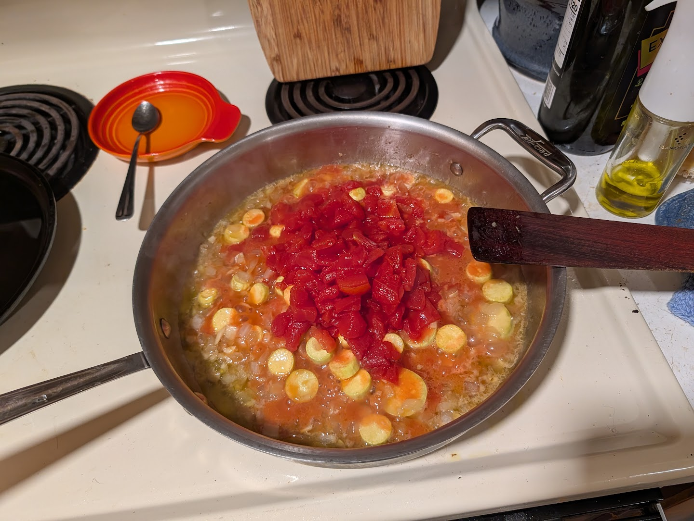
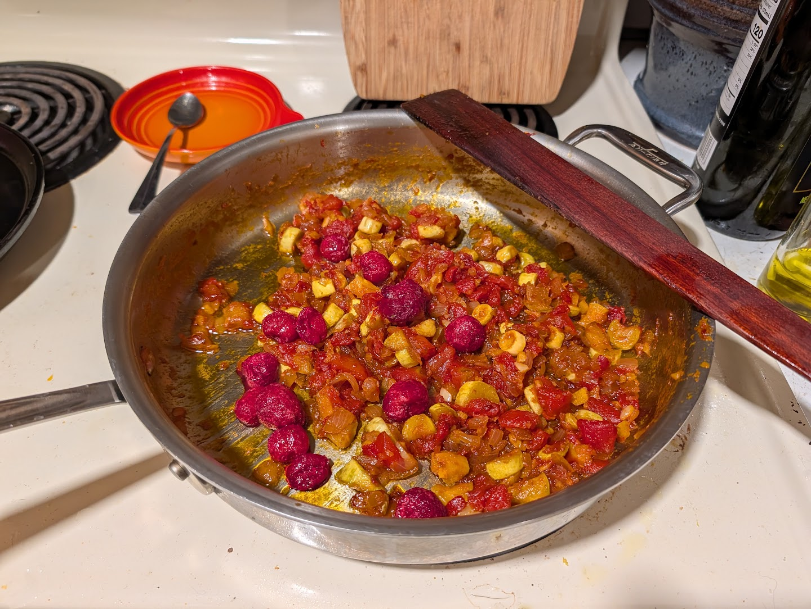
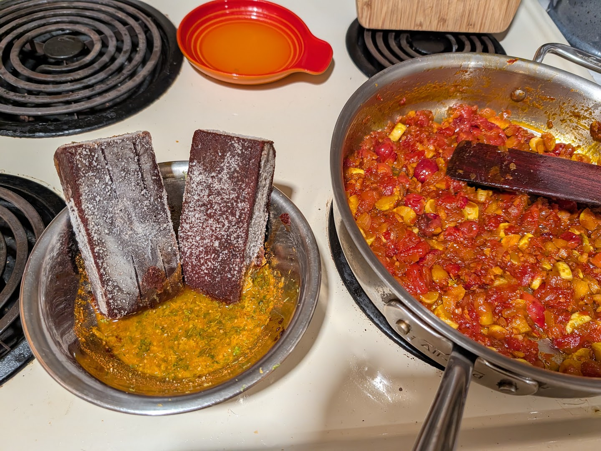

A dark, fruity red sauce that leans on my [red chile base]({filename}/food/red-chile-base.md).
Tomatoes and cherries cook down to a paste, the chile base melts in, and citrus
and spice brighten it at the end. Spoon it over stewed meat or simmer chicken
right in it for tacos, enchiladas, and the like.

!!! ingredients "Ingredients"
    ## Initial paste
    - 1 T oil or butter
    - 1 onion, _diced_
    - 3 cloves garlic, _minced_
    - 1.5c diced tomatoes
    - 1c frozen sour cherries
    - 1 T chicken stock concentrate

    ## late addition
    - 1c red chile base
    - 1 lime, _zested and juiced_
    - ~1 tsp paprika, cayenne, or hotter chile powder
    - ~1 tsp garlic powder
    - ~1/2 tsp coriander

## Preparation

Sweat the onions and garlic in oil or butter until soft. Add the diced tomatoes,
cherries, and a chicken stock concentrate.

Reduce slowly, letting it deepen to a paste — take your time, don't scorch it, and let the
flavor concentrate.

Stir in the red chile base and the rest of the late addition ingredients.

Give it a quick final simmer to marry everything and take the edge of the raw chile and spices.

## Serving

Serve over chicken, or use it as a simmer sauce for chicken tacos/enchiladas, or
do a longer braise with thighs or even pork shoulder.
