## Chicken paprikás, a family favorite.
One of my favorite meals growing up was my Grandma Jean's chicken paprikás. She made it at least several times a year for us while I was growing up. Recently my wife Sara and I have been going to her house once a week to visit and make her dinner. This week it was our turn to make this dish for her.

## The prep
The stock, dumplings, and chicken brine, were completed the day before visiting Grandma.

### Chicken stock
This recipe is from scratch, including the stock.

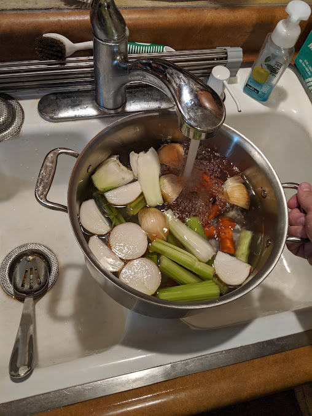

After breaking down the chicken into skin-on legs, wings and breasts, I browned the chicken scraps by roasting them in the oven before adding them to simmer in the stockpot.

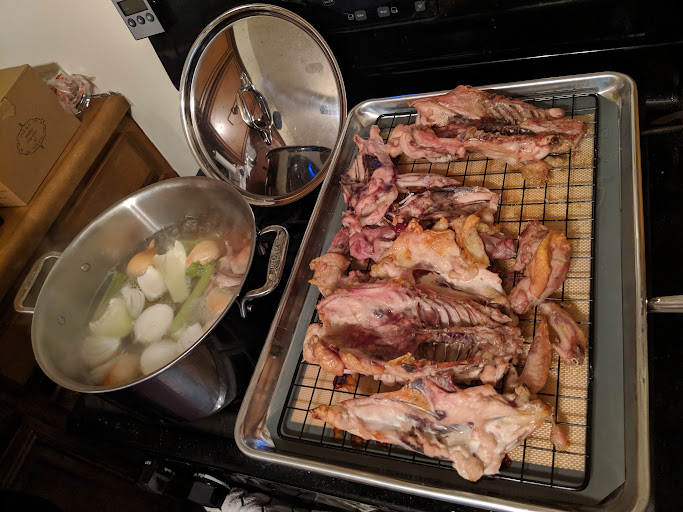

Liquid chicken gold.

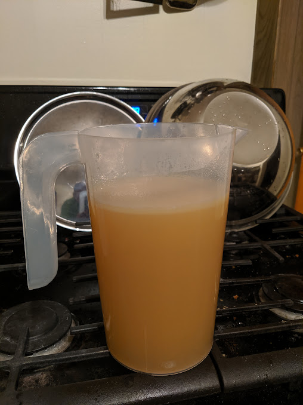

### Brining the chicken pieces
One key to extra moist and flavorful chicken is a 6 hour brine.

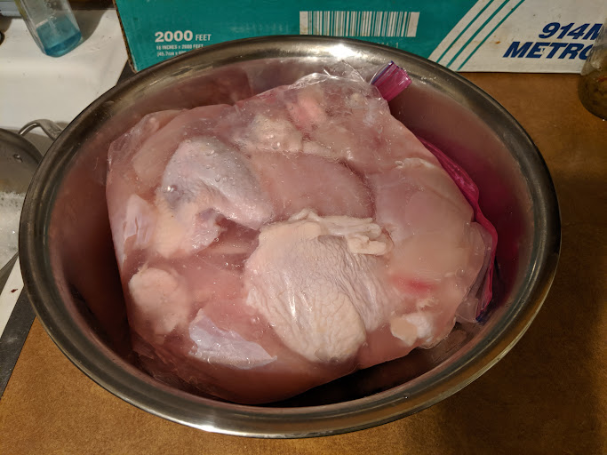

### The dumplings
Because they are time-consuming, I also made the dumplings the day before.

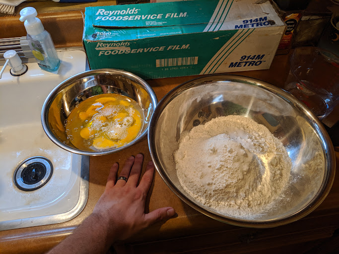

Use the "well" technique.

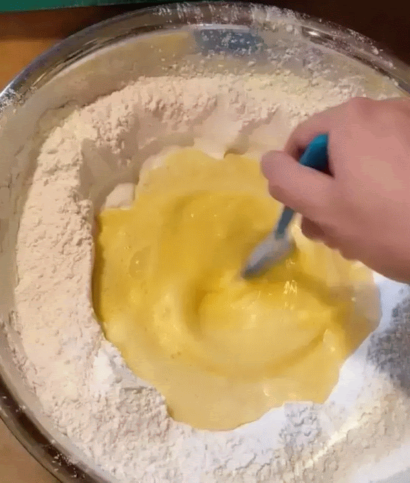

We have always made them larger than German spaetzle, and slightly larger than traditional Nokedli.

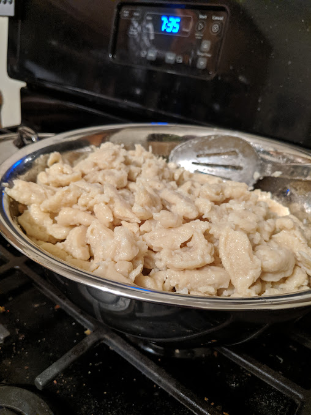

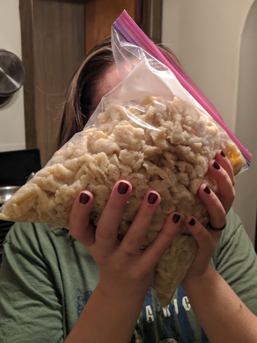

## Bringing it all together
On the day of the dinner we fried and simmered the chicken and prepared the most important part, the sauce.

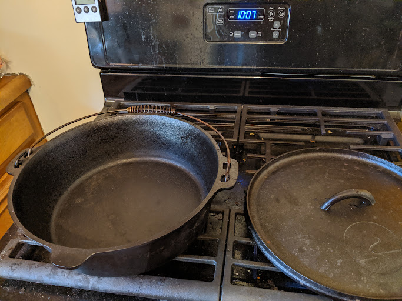

Render a whole pound of bacon fat, keep the crispy bacon for a topping.

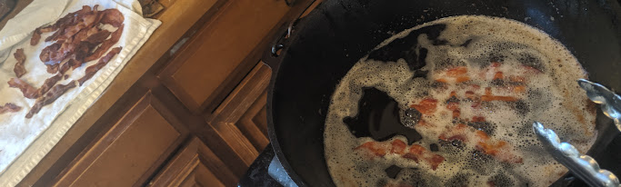

Bread the chicken with a mixture of flour, paprika, and salt to taste.

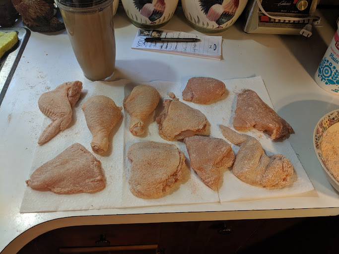

Brown the chicken to add flavor, no need to cook thoroughly.

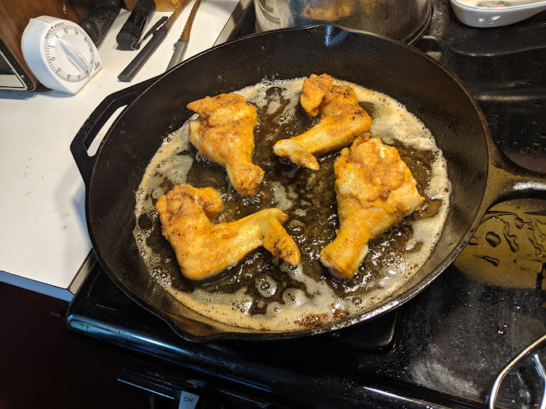

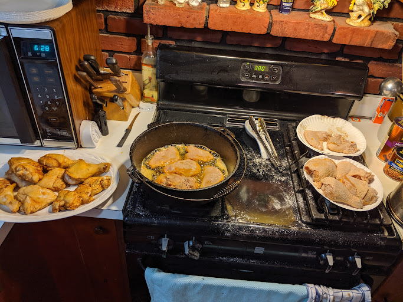

Now simmer the onions in the remaining grease just until translucent.

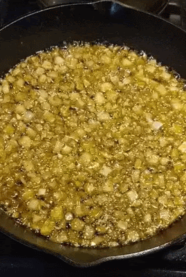{: width=40% }

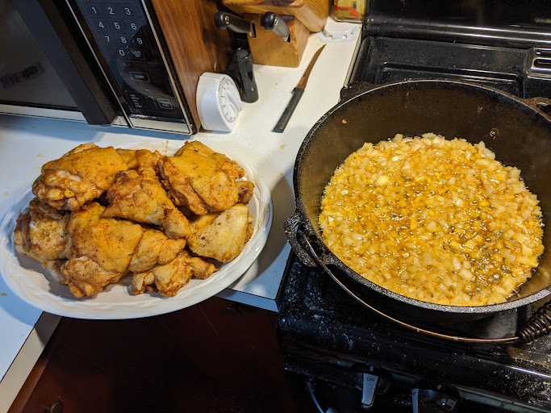

Layer the onions in with the chicken.

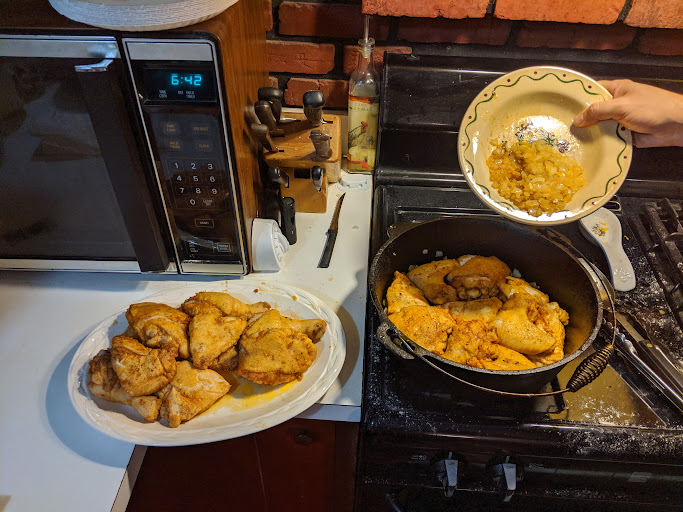

Now add with chicken stock concentrate.

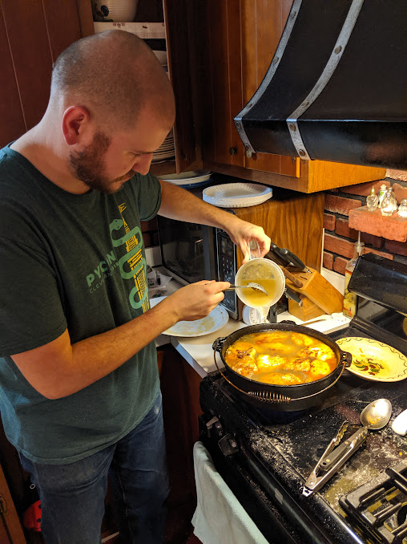

Simmer long enough to finish cooking the chicken and completely disintegrate the onions.

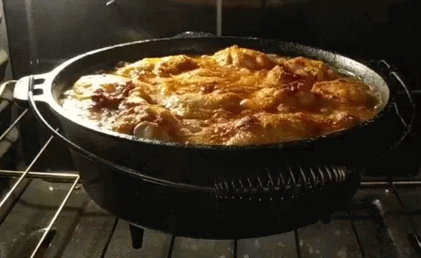

The finished product. To finish the sauce, add paprika and sour cream to taste. You can also thicken with flour if needed.

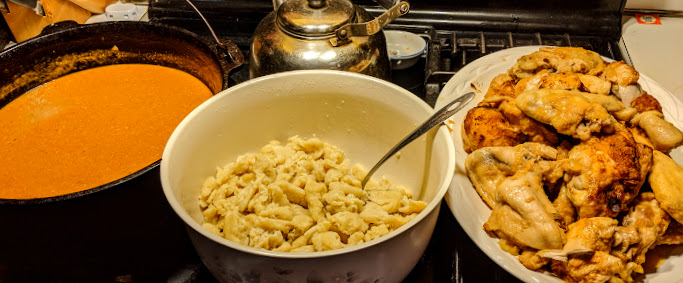

We all enjoyed it.

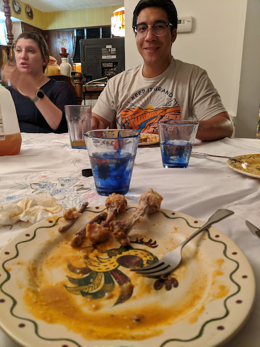
