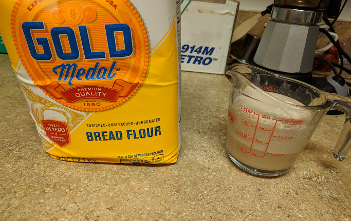
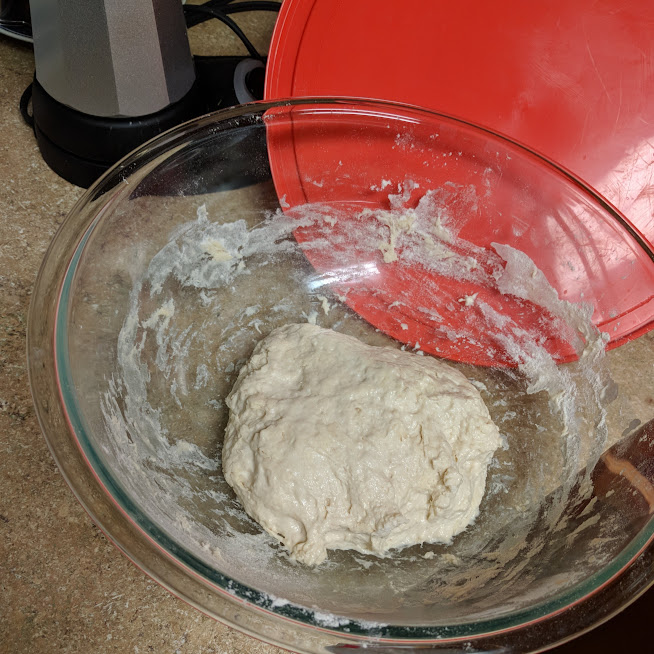
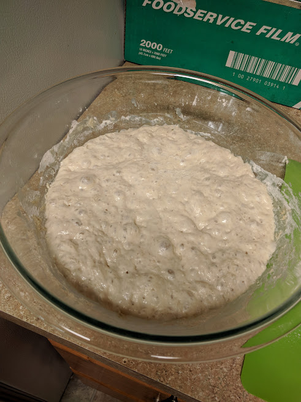
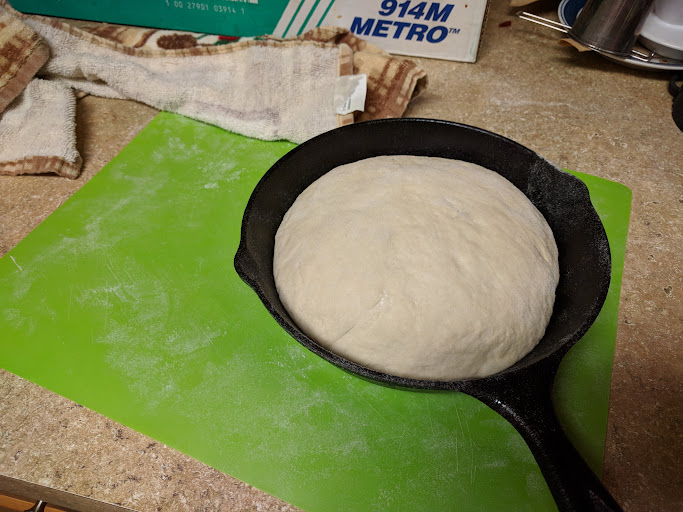
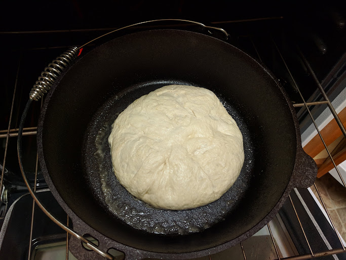
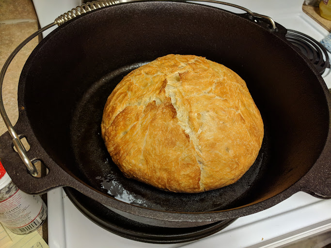
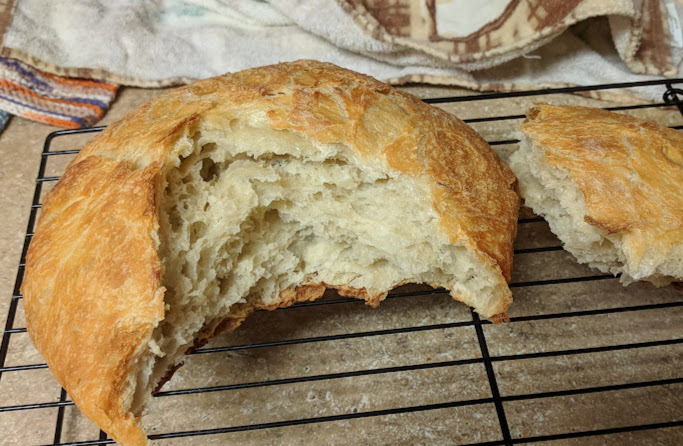

## My first shot at baking bread
Proofing the yeast in a warm water with sugar. The foam means it's still alive.

Mix flour and water well, then incorporate salt and yeast.

Yeast doing its job.

Proofing dough in a frying pan. Final rise is to allow the gluten to relax enough for a big rise to happen in oven.

Flipped dough into a dutch oven. Cover and bake at ~450F.

Success!

