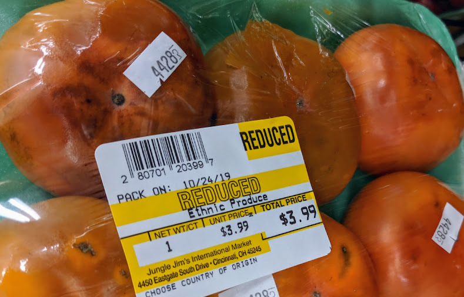
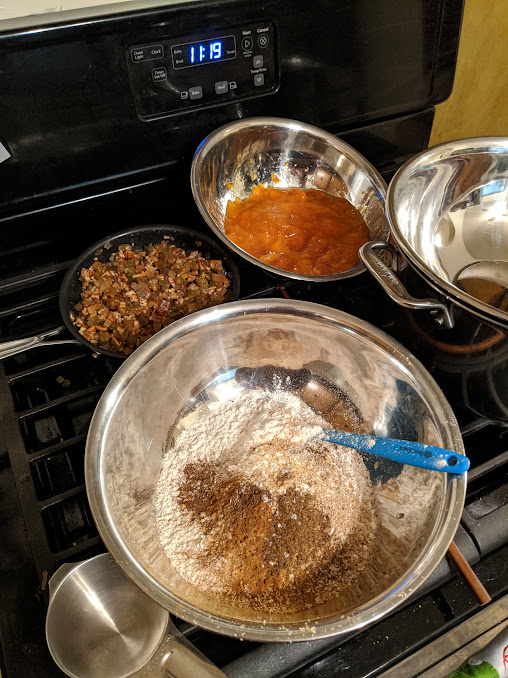
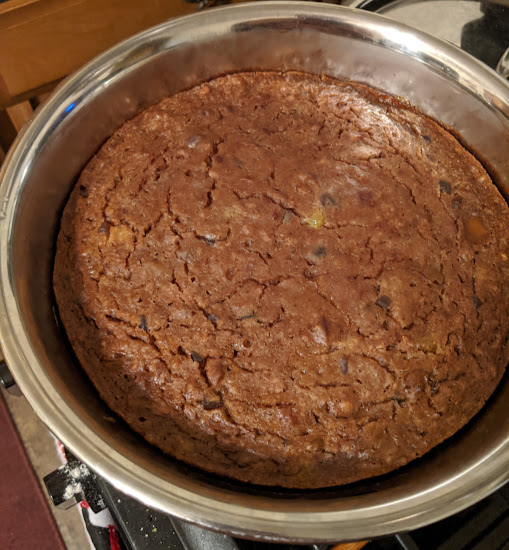
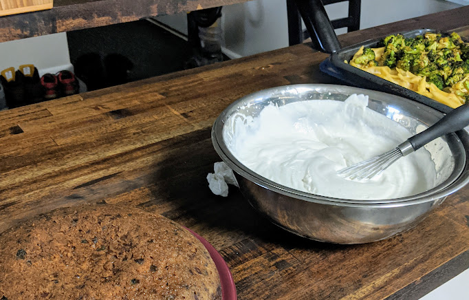
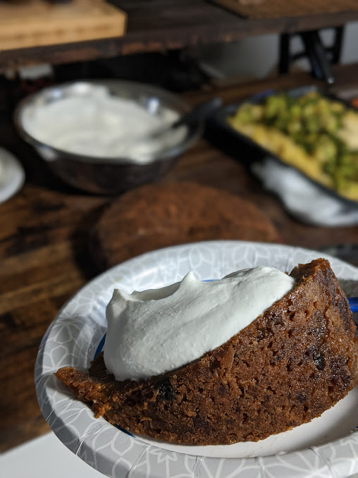

## What to do with 6 ripe persimmons?
Whenever I visit [Jungle Jim's](https://junglejims.com/), a Cincinnati international market known as "a theme park of food", I make sure to hunt for a new fruit. After grabbing a few interesting specimens to try, I found a section that I had never noticed before: clearance fruit. Normally overripe fruit wouldn't be too exciting, but persimmons are best when super-ripe. I took home a six pack, but I didn't have a plan for them yet.

After a bit of googling, I settled on making an English style holiday pudding. Not being British, this was a dish I was only vaguely aware of. After reading about the dessert a bit on the internet, I had a case of what googling calls the [Baader-Meinhof Phenomenon](https://english.stackexchange.com/questions/153166/what-is-the-term-for-when-you-become-more-aware-of-something). It was everywhere. The strongest example was when I went to see a Christmas Carol *again*, I can't believe that the "pudding scene" had always been there, never stirring my brain to ask "wtf is this pudding?" before, I think I thought it was meat.

My recipe is based on:

> <https://www.marthastewart.com/340210/steamed-persimmon-pudding>

!!! section "Ingredients"
    ## Ingredients

    ### Wet
    - 1/2 c. unsalted butter
    - 2.25 c. sugar[^sugar]
    - 6 very soft persimmons
    - 1.5 c. whole milk
    - 5 large eggs
    - 2 teaspoons pure vanilla extract
    - 1 lemon

    ### Dry
    - 3 c. all-purpose flour
    - 3 teaspoons ground cinnamon
    - 1 whole freshly ground nutmeg
    - 21 allspice berries
    - 13 cloves[^cloves]
    - 3 segment of a star anise[^anise]
    - 1/2 teaspoon coarse salt
    - 1 1/2 teaspoons baking soda

    ### Simmered
    - 1/2 c. brandy
    - 1/3 c. sultanas (golden raisins)
    - 1 c. pecans, coarsely chopped
    - 1/3 c. finely chopped candied ginger
    - 4oz chopped candied citron

    ### Topping
    - 2 c. heavy cream
    - 1/4 c. brandy
    - 2 T Powdered Sugar

[^sugar]: Yes, I know sugar is not actually wet.
[^cloves]: I didn't include cloves in the mine, but I thought it would be good addition.
[^anise]: I originally only included one segment of anise.

## Directions
### Step 1 - Prepare the mold
Traditionally one would use an English pudding mold, I didn't have that so I buttered a large stainless steel mixing bowl. I used a stock pot as the boiler setting the mixing bowl on top. Add enough water to the stockpot to come halfway up the mold; to gauge depth, test this with an empty mold by pressing in into the water.

### Step 2 - Prepare the dry ingredients
Sift flour, and add all "dry" ingredients to a bowl. Stir until evenly distributed.

### Step 3 - Simmer the tasty bits
Toast pecans in a frying pan and add all "Simmered" ingredients. Simmer for about 10 minutes.  Remove from heat; let stand for 15 minutes, allowing time for fruit to soak up excess moisture and become tender.

### Step 4 - Combine the wet stuff
Meanwhile, slice tops off persimmons. Note: Original recipe says to press the fruit through sieve to remove skin. This is hopeless with a normal strainer and it's not hard to just separate skins by hand. Scoop out flesh, discard skins. (you should have 2 3/4 cups persimmon puree). Whisk in milk

Cream butter and sugar; then add the rest of the "Wet" ingredients to the butter mixture. If you are using an electric mixer be sure to keep the bowl scraped.

### Step 5 - Bring it all together
Using minimal mixing, fold in all of the dry ingredients over a few quick additions. While still partially unmixed dump in "simmered" mixture of pecans, raisins, ginger, etc. Fold all until just barely mixed. Pour into prepared mold and cover with lid.

{: width=70% }

### Step 4 - Let it steam
Bring water in stockpot to a boil. I let this go ~8 hours because of the size, 6 probably would have been ok. Since it's being steamed it can really get overcooked unless it starts to dry out. Time really depends on shape of mold+pot and the size of the pudding. Use a toothpick or skewer and test that the center is no longer a batter before calling it done.

{: width=50% }

### Step 5 - Serve with cream
Now we are ready to serve.

