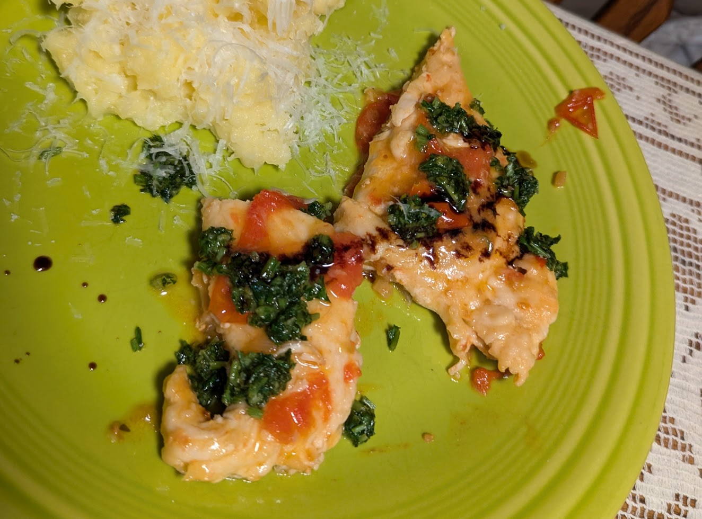
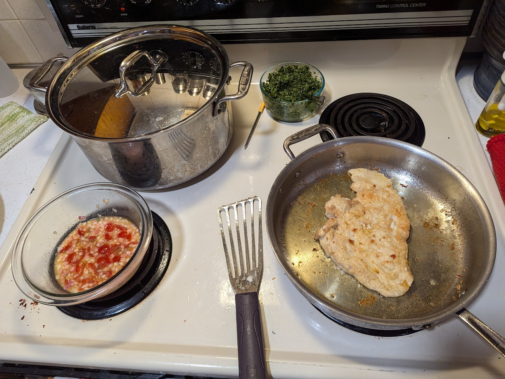

## Ingredients

### Gremolata

- Zest of 2 oranges
- Juice of ½ orange
- 1 bunch parsley, finely minced
- 5 cloves garlic, grated
- Olive oil
- Salt
- Lemon juice

### Pan Sauce
- 8 cherry tomatoes, quartered
- 1 shallot, finely diced
- Juice of remaining 1.5 oranges
- 1 Tbsp fig jam
- 2 tsp chicken stock concentrate
- 1 tsp capers, minced
- Lemon juice
- White wine or water
- 2 Tbsp butter

### Chicken
- 2 chicken breasts, flattened
- All-purpose flour, for dredging
- Olive oil

---

## Preparation
### Gremolata
Mix parsley, orange zest, garlic, and juice of ½ orange. Add just enough olive oil to coat the mixture, season with salt and lemon juice to taste.

### Chicken
Dredge flattened chicken in flour and fry in olive oil, taking care not to overcook. Remove and set aside.

### Pan Sauce

- Sauté shallots and cherry tomatoes together until softened
- Add orange juice, fig jam, stock concentrate, capers, and lemon juice to taste, and reduce to deepen flavors
- Thin with a splash of white wine
- Remove from heat and stir in butter

### Plating
- Coat and rewarm the chicken in the sauce.
- Serve chicken topped with gremolata and a drizzle of Aceto Balsamico di Modena.

## Notes

- Chicken prep suggestion: butterfly breasts completely apart and pound flat. Then cut each half in half again for a final yield of 4 portions per breast.
- The flour dredge is important for thickening the sauce. Start with sauce thinner than you want, it will thicken as the chicken pieces cool down the sauce and release starch from the dredge.
- Freeze-dried shallots can be substituted for convenience as they retain the flavor of fresh shallots. If using freeze-dried shallots, add them with the liquids rather than sautéing. Onion is a fine substitute.
- The lemon is just for adjusting acidity and I find crystallized lemon, e.g. TrueLemon convenient
- Use crushed red pepper, harissa, or calabrian chili paste to spice up the sauce.
