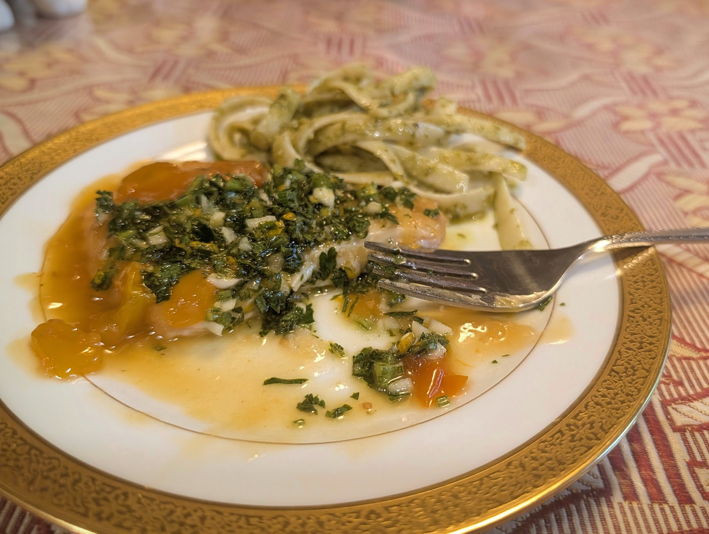
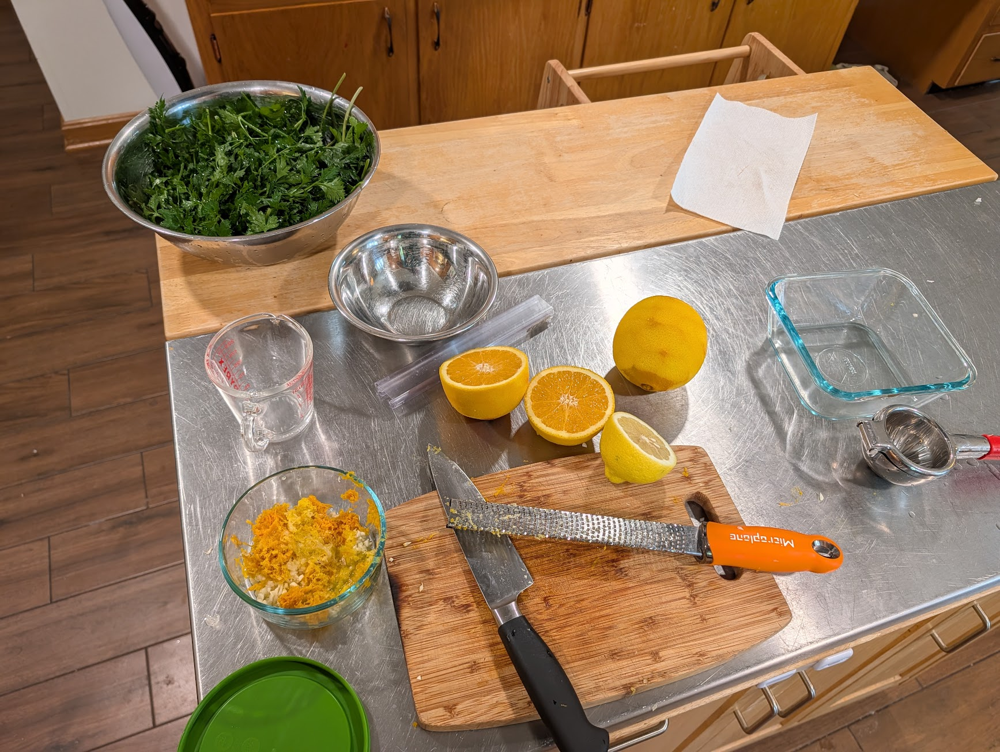
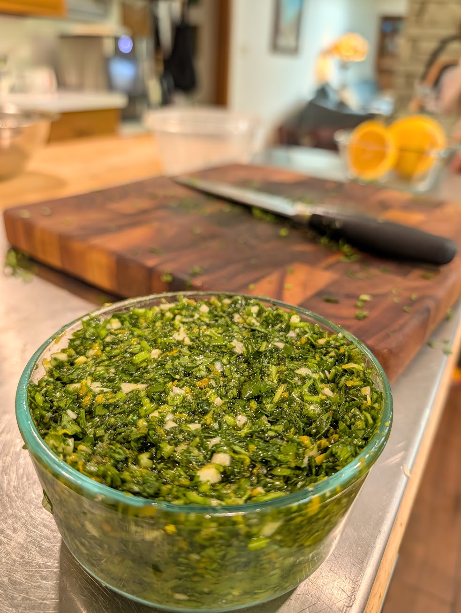
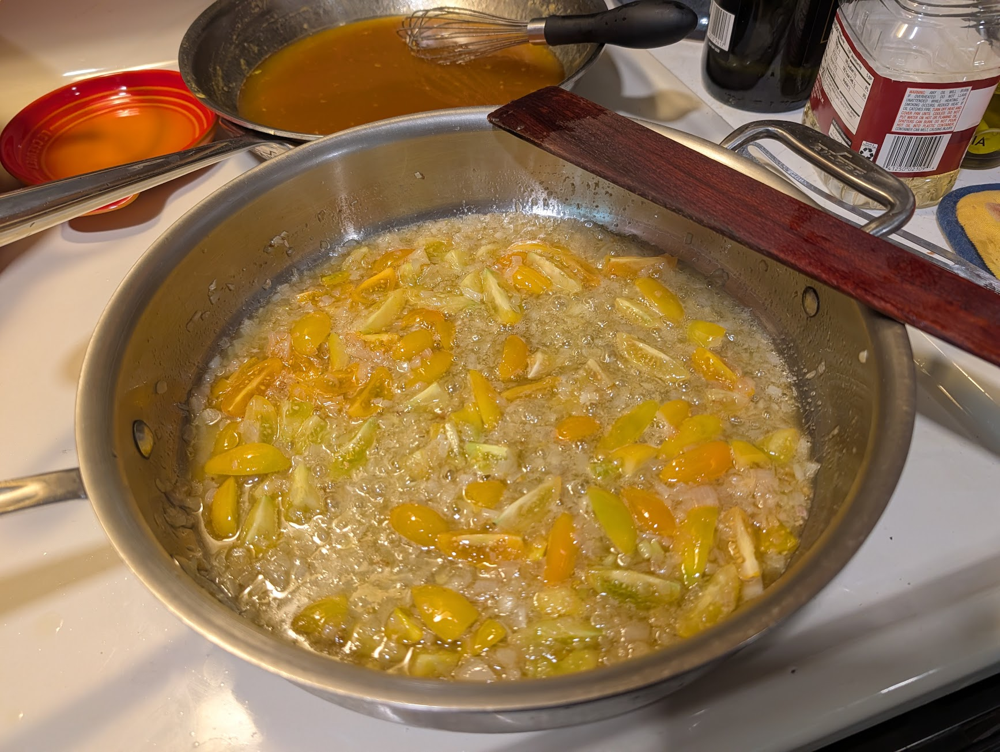

!!! section "Ingredients"
    ## Ingredients

    ### Gremolata

    - zest of 2 oranges
    - juice of ½ orange
    - zest + juice of ½ lemon
    - 1 bunch parsley, _minced_
    - 5 cloves garlic, _minced_
    - olive oil
    - salt

    ### Pan Sauce
    - 8 cherry tomatoes, _quartered, orange-colored_
    - 1 shallot, _finely diced_
    - juice of remaining 1.5 oranges
    - 1 Tbsp preserves, _orange-colored such as orange, fig, pear, or dandelion_
    - 2 cup chicken stock
    - 1 cup dry white wine
    - 3 Tbsp Grand Marnier, _optional_
    - 2 Tbsp butter

    ### Chicken
    - 2 chicken breasts, _flattened_
    - salt, _1% by weight of the chicken, for dry brining_
    - flour, _for dredging_
    - 2 eggs, _beaten with ~1 Tbsp water_
    - olive / neutral oil, _to taste, for frying_

## Preparation
### Gremolata

Mix parsley, orange zest, lemon zest, garlic, orange juice, and lemon juice. Add just enough olive oil to coat the mixture and season with salt to taste.

### Chicken

Dredge the chicken in flour and let rest.

Francaise the cutlets by dipping them in the egg mixture and immediately frying, taking care not to overcook. Move the fried cutlets to a covered Dutch oven preheated to 170°F.

### Pan Sauce

- Sauté shallots and cherry tomatoes together in the fry pan until softened
- Add orange juice, preserves, stock, wine, and Grand Marnier, then reduce.
- Remove from heat and stir in butter
- Pour the finished sauce into the warm Dutch oven and gently turn the cutlets for full coverage.

### Plating
- Serve chicken topped with spoonful each of extra sauce and gremolata.

## Notes
- Chicken prep: slice breasts and then pound flat. Then portion for a final yield of 3-4 cutlets per breast. Dry brine the flattened cutlets with ~1% salt, packed tight and covered overnight, this improves texture, firming them up for dredging and frying.
- The lemon is for adjusting acidity, and I find crystallized lemon convenient
- Use crushed red pepper, harissa, or calabrian chili paste to spice up the sauce.
- The chicken holds well sauced and warm in the Dutch oven.

