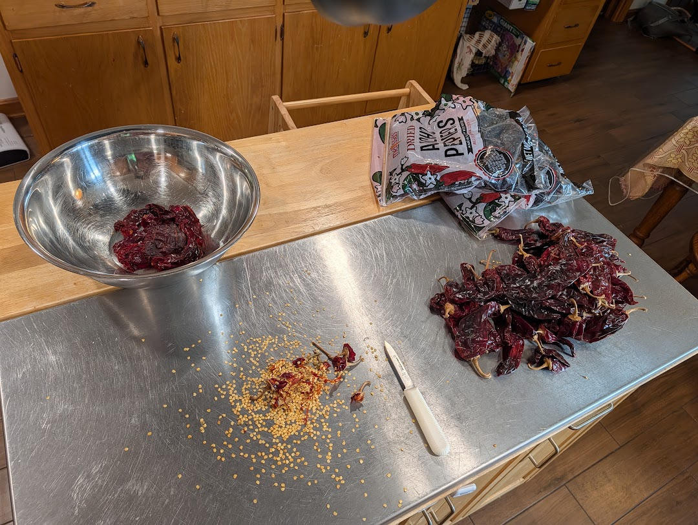
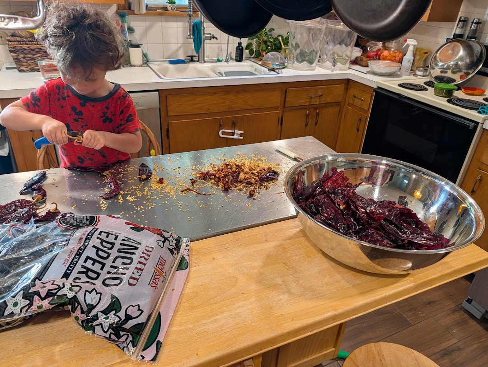
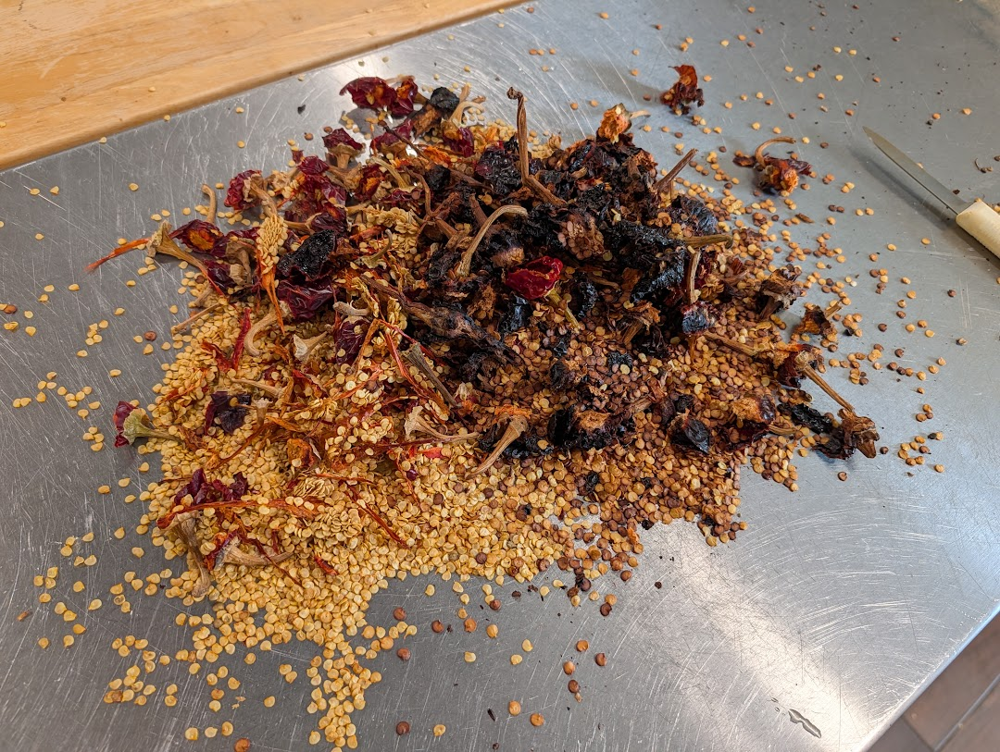
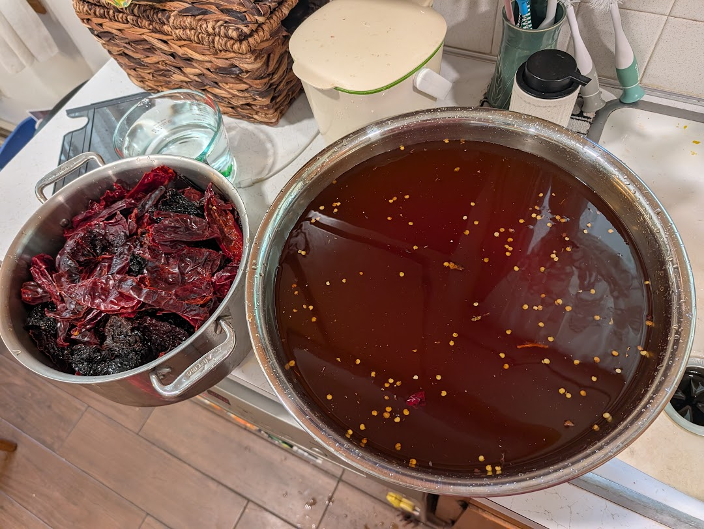
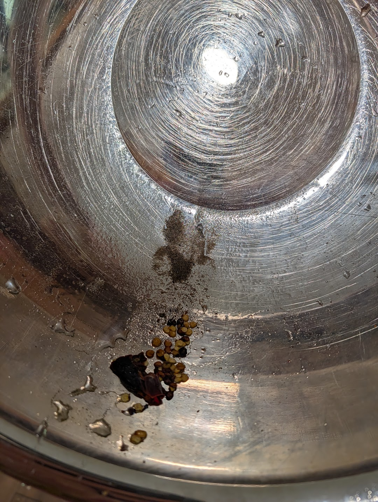
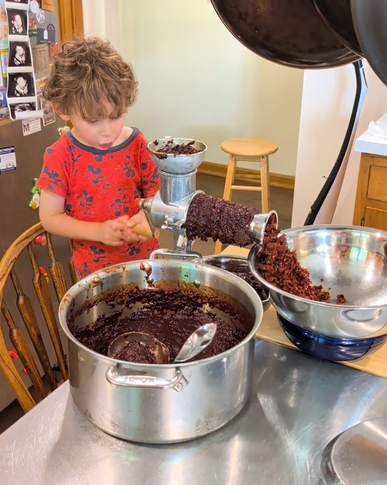
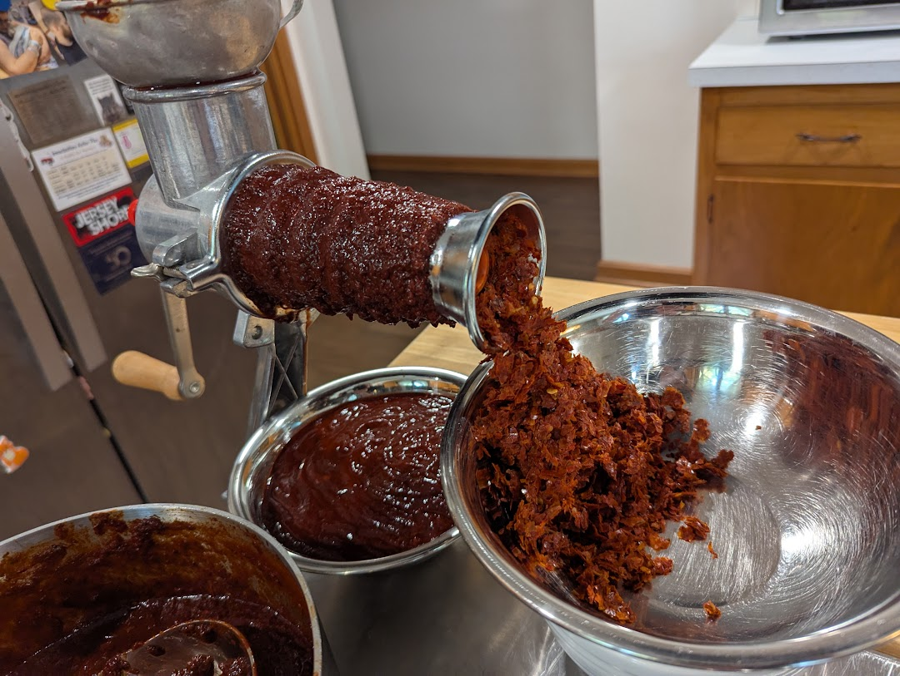
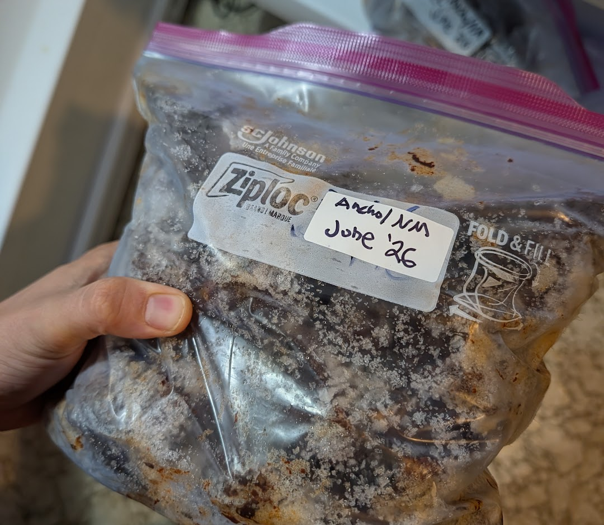
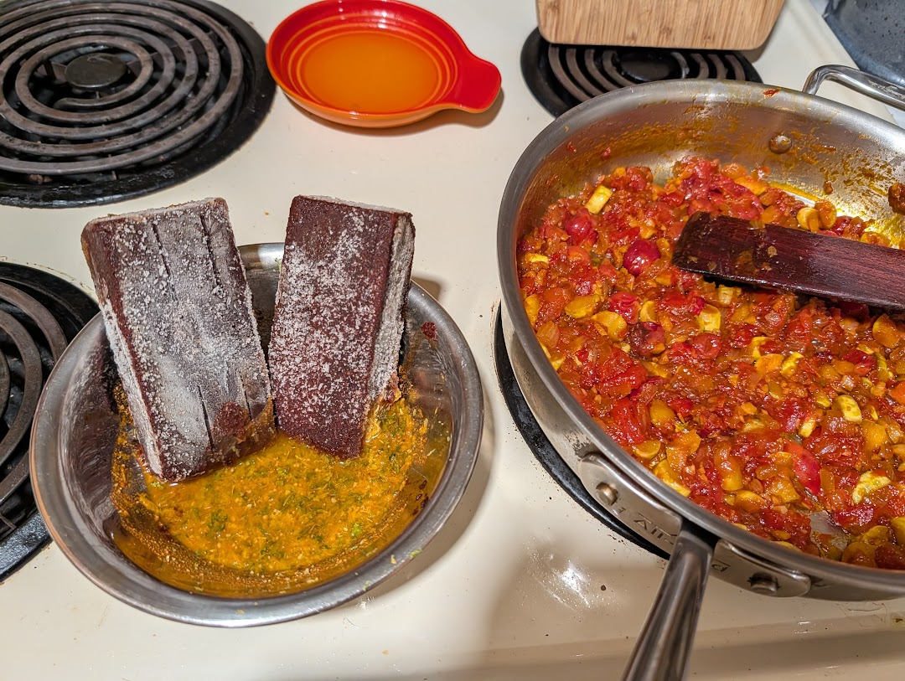

This red sauce base: a smooth, strained purée of rehydrated dried
chiles with nothing extra but lime, and a little salt. Make a giant
batch, freeze it into bricks, and drop them frozen into whatever wants a deep
red-chile backbone — tacos, chile colorado, enchiladas, or my
[cherry roja chicken]({filename}/food/cherry-roja.md).

## Picking chiles

Grab **two big bags of dried chiles** and mix and match — I buy a couple kinds,
blend them, and work through the batch over the next few months. Treat every
batch as an experiment and keep notes on what you liked. A quick guide to the
common varieties:

- **Ancho** (dried poblano) — deep mahogany, almost black-red. Sweet and
  raisiny with notes of dried plum and cocoa. Barely any heat; the backbone of
  most blends.
- **New Mexico** — earthy brick red. Roasted, slightly acidic, classic
  "red chile" flavor. Medium heat.
- **California** (dried Anaheim) — the mild cousin of New Mexico. Clean, sweet,
  bright red, and low heat. Good for stretching a blend without adding fire.
- **Guajillo** — bright, translucent red. Tangy and berry-like with a green,
  tea-ish edge. Mild-to-medium heat and lots of clean brightness.
- **Pasilla** (dried chilaca) — dark, blackish brown. Raisiny and herbaceous
  with cocoa notes. Mild-to-medium heat and a lot of depth.

!!! ingredients "Ingredients"
    - 2 big (12oz) bags dried red chiles, _mixed and matched_
    - water
    - 1–2 limes, _juiced_
    - 1 tsp salt

## Preparation

### Deseed

Tear or cut the stems off and shake out the seeds. Work over a big surface and
go bag by bag.

As you go, **inspect each pepper** — look for mold and discard any that are
fuzzy, or thinned out/rotten. Many hands make light work.

The seeds and stems get tossed.

### Wash and rehydrate

Soak the deseeded chiles in a **giant excess of cold water**, agitating well.
The extra water lets dirt and sand fall to the bottom while the chiles rehydrate.

!!! note
    Use **cold** water, not hot. Most of the flavor stays locked in the pepper,
    so you can pour off the dirty water without missing it — and that water gets
    genuinely filthy.

You'll be surprised how much sand settles out.

### Blend and strain

Blend the rehydrated chiles with **just enough water** to get everything moving
into a purée — an immersion blender or a Vitamix-style both work.

Run the purée through a sauce strainer, I have a _Victorio #200_. This leaves the skins and any stray seeds
behind. Set up your catch bowls as needed and crank it all through.

Smooth chile base comes out the side while the dry skins extrude out the end.

### Season

Stir in the juice of **1–2 limes and 1 tsp salt**, mixing until the salt
dissolves.

## Freezing

Freeze the base in Souper Cubes, silicone muffin trays, or anything that gives
you portioned bricks. Bag and label them once solid.

## Using it

The bricks go straight into the pan **frozen** — no need to thaw — whenever
you're making tacos, chile colorado, enchiladas, and the like.

A couple of quick ways to use it:

!!! ingredients "Salsa Roja"
    - 1 c red chile base
    - 1 onion, _finely diced_
    - 2 tomato, _diced_
    - 2 cloves garlic, _minced_
    - 1 lime
    - salt, _to taste_

Sweat the onion, tomato, and garlic, stir in the chile base, and simmer a few minutes to
loosen and warm through. Finish with lime and salt.

!!! ingredients "Enchilada Sauce"
    - 1 c red chile base
    - 2 c chicken stock
    - 1 T oil
    - 1 tsp cumin
    - 1 tsp dried oregano
    - 1 tsp garlic powder
    - salt, _to taste_

Bloom the cumin and oregano in the oil, add the chile base and stock, and simmer
until it coats a spoon. Season with garlic powder and salt.
