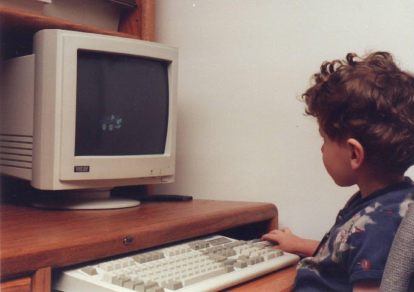
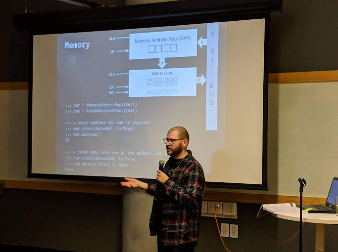

## Purpose of this blog
The reason this site exists is to track and showcase my various projects. I
value having an accurate timeline of when the projects were worked on more than
when they were written about.

### Use of dates
To have an accurate project timeline, I will make the date of an article be the
date when a project or stage of a project was completed. So you can still know
when an article was published, I will use the last modified on field even for new
articles. This not only ensures an accurate timeline, but it gives the
opportunity to go back and curate past projects.

### Historical stubs
For some historical projects I plan to just make a stub article and include a few photos. If there is interest in any one of them in particular I will update with more details. This can also just serve as an index for when I need to showcase my talents; I can elaborate on them in person.

Thanks for reading, and I hope you have found something useful or entertaining here.

