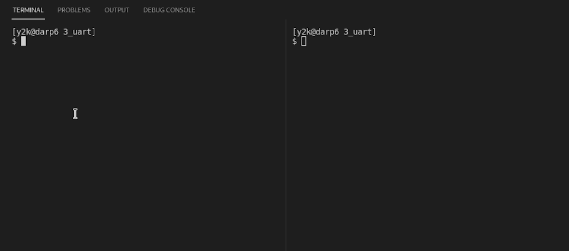

[TOC]

## Baremetal RISC-V Renode series
I'm exploring the line between hardware and software by creating a series of demos within a minimal, free and open source environment. These demos span from blinking an LED to implementing a toy operating system. The goal is to minimize parts of the system that we take for granted and gain a better understanding of computers and operating systems.

Start at [Part 1]({filename}/programming/baremetal-riscv-renode-1.md), we setup a bare minimum LED blinking example to demonstrate how to compile your development environment and debug the software in real-time using GDB.

## Background
In this article we will be interfacing with a virtual UART. This will allow us to input and output a serial stream of character bytes.

This example includes a few new concepts.

- Interrupts
- C, including initialization

## Adding a UART to Renode
We are using the UART from the Litex project. Litex is a High Level HDL project that makes it easy to design a system on a chip and target both simulations and FPGA.

Because we are dealing with virtual hardware there isn't a datasheet. Instead we have 3 different code repositories that are useful for understanding the virtual hardware.

- The actual Litex [hardware description](https://github.com/enjoy-digital/litex/blob/master/litex/soc/cores/uart.py) for the UART
- A [UART driver](https://github.com/enjoy-digital/litex/blob/master/litex/soc/software/libbase/uart.c) also provided by the Litex project
- The Renode project provides a software [emulation](https://github.com/renode/renode-infrastructure/blob/master/src/Emulator/Peripherals/Peripherals/UART/LiteX_UART.cs) of the Litex UART. This implements the hardware functionality without having to do a full verilog or gate-level simulation.

To get the offsets and registers the easiest way was to look at the Renode emulation directly. You can see that

```csharp
private enum Registers : long
{
    RxTx = 0x0,
    TxFull = 0x04,
    RxEmpty = 0x08,
    EventStatus = 0x0c,
    EventPending = 0x10,
    EventEnable = 0x14,
}
```

The actual configuration of the UART hardware is a very simple addition:

vexriscv.repl

```text
...

uart: UART.LiteX_UART @ sysbus 0x60001800
    -> cpu@2
```

All we needed to decide was where in memory to map the hardware, and what interrupt number to wire it to.

## A quick note about using C
This example is going to use C functions in addition to assembly.

Since we are baremetal we need to set up the stack pointer ourselves.

baremetal.s

```asm
# setup a stack pointer
la sp, memtop
```

## Interrupt handling
Interrupts are an asynchronous way to externally trigger the CPU to jump.

Typically they jump to a particular memory location, or a location + an offset based on the reason for the interrupt.

### RISC-V interrupts
RISC-V interrupts come in two flavors, the original Core Local Interrupter (CLINT), and the Core Local Interrupt Controller (CLIC).
The difference between the two, and much more, is described in the sifive interrupt cookbook.

<https://sifive.cdn.prismic.io/sifive/0d163928-2128-42be-a75a-464df65e04e0_sifive-interrupt-cookbook.pdf>

## Driver code
All that is left is to write the code to actually interact with the hardware.

Note that we are going for understandability, not performance, so we are creating an unbuffered solution here.

Define a hardware register map to memory.

baremetal.c

```c
typedef struct
{
    uint32_t RxTx;
    uint32_t TxFull;
    uint32_t RxEmpty;
    uint32_t EventStatus;
    uint32_t EventPending;
    uint32_t EventEnable;
} UART;

const uint32_t TxEvent = 0b01;
const uint32_t RxEvent = 0b10;
volatile UART *const uart = (UART *)0x60001800;
```

We need to set a flag in the UART to enable interrupt events.

```c
void init_uart()
{
    uart->EventEnable = RxEvent;
}
```

This is called during startup, right before the final `wfi` spin-loop.

```asm
...

    # set mie.MEIE=1 (enable M mode external interrupts)
    li      t0, 0b0000100000000000
    csrrs   zero, mie, t0

    call init_uart

wait_for_interrupt:
    wfi
    j wait_for_interrupt
...
```

Then we just need to specify what to do when an interrupt comes in.

In the real world you would need to check the reason code and figure out:

1. What type of interrupt are we handling
2. What is the reason for the interrupt?

We can safely ignore this for our demo because the only source of interrupts will be the UART receiving a character.

```c
void interrupt_handler()
{
    fancy_char((char)uart->RxTx);
}
```

For fun, we echo the transmitted character surrounded by an ASCII art border.

```c
void fancy_char(char c)
{
    char s[] = "\n###\n\r#X#\n\r###\n\r\n\r";
    s[7] = c;
    puts(s);
}

void putc(char c)
{
    uart->RxTx = c;
}

void puts(char *str)
{
    while (*str != '\0')
        putc(*str++);
}
```

## Run the example
Ensure you have the setup from [Part 1]({filename}/programming/baremetal-riscv-renode-1.md) completed.

Switch to the folder `3_uart`

In one terminal run:

```bash
$ make start
```

then in another terminal:

```bash
$ make uart-poll
```

then you can send characters via the UART connection.



## Next post
In [Part 4]({filename}/programming/baremetal-riscv-renode-4.rst) we'll start to build the basics of a minimal preemptive multitasking toy OS called KOS as a way to learn more about baremetal programming. The first part we'll cover is how programs and processes are defined.
