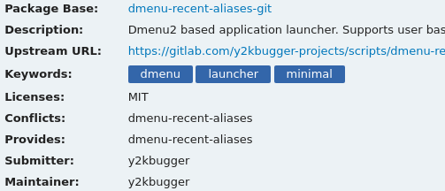
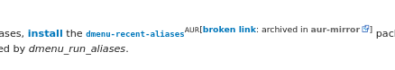

## Long time user, first time maintainer
I've been a Linux user for a decade now, Ubuntu at first, but I switched to [ArchLinux](https://archlinux.org) after a year or two. I quickly found the [Arch User Repository](https://aur.archlinux.org/) or AUR to be a treasure trove of free (libre) software; I am still in awe today. On ms windows, finding software meant downloading binaries from sketchy freeware sites. The prospects were better on Ubuntu since many software projects engaged with the community and produced regular releases. One drawback however were the stale repos, some packages on ubuntu were still pointing at releases that were years old. The Ubuntu [Personal Package Archives](https://launchpad.net/ubuntu/+ppas) PPAs was supposed to solve this, but I never had  good luck with them. The packages always seemed random whether or not they were compatible and maintained.


Enter ArchLinux, everything is on the bleeding edge. The vast majority of typical software needs is packaged and up-to-date. For more custom software, there is the AUR. It started as just people sharing recipes for building packages...and well, that's still the case and it's a *really* good thing too, its beauty is in the simplicity. Packaging makes sure that the software you install goes in cleanly and can be removed without leftover files. You can think of ArchLinux as basically a package manager[^pacman] and a wonderful community. The AUR acts as a funnel for new packages to become official in the community repository, which are built packages rather than just recipes.

[^pacman]: See pacman: <https://wiki.archlinux.org/index.php/pacman>

## My contribution
For my first contribution I wanted something simple, just to learn the process. At work I have been spending a lot of time with the conda package manager, and a few months ago I submitted my first conda-forge recipe. For a long time I have wanted to put something on AUR and now that packing is fresh on my mind I figured it's a good time to get this one under my belt. I chose a shell script that I have used for years; it is a fork of a now deleted AUR package. Since it's a shell script it still needs to be installed to the system but it doesn't have the complication of needing to be compiled.



The package is called `dmenu-recent-aliases`, and it is a lightweight application launcher. It provides fuzzy searching for all the executables on your `PATH` and also includes your custom bash functions and aliases. I have added a few extra features as well, for the full docs see <https://gitlab.com/y2kbugger-projects/scripts/dmenu-recent-aliases>.

A second reason for choosing this one is that there is some demand for the script and the original is no longer being maintained.



## Become a maintainer yourself
Before you start to make a package, you should be familiar how to manually install other's packages from the AUR. Avoid AUR helpers for a while, trust me.

Here is the quickstart guide:

<https://wiki.archlinux.org/index.php/Arch_User_Repository#Installing_packages>

As far as the packaging process goes, it's not too difficult but I can't begin to cover it all here. Instead, I recommend reading at least all of these:

- <https://wiki.archlinux.org/index.php/Creating_packages>
- <https://wiki.archlinux.org/index.php/Arch_package_guidelines>
- <https://wiki.archlinux.org/index.php/AUR_submission_guidelines>

It may also be helpful to check out my minimal `PKGBUILD` here.

```bash
git clone https://aur.archlinux.org/dmenu-recent-aliases-git.git
```

After you cobble together what you think is a good `PKGBUILD` you can ask for a review on the `#archlinux-aur` IRC. Try [IRCCloud](https://www.irccloud.com/) if you aren't familiar with IRC.

Finally, submitting is as easy as a git push, but be sure all of your i's are dotted and t's are crossed.

Now you are <strike>all done</strike> just beginning. As a maintainer it's your job to keep the package up-to-date and incorporate suggestions from the community.
